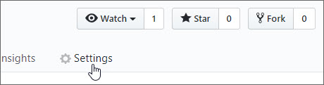
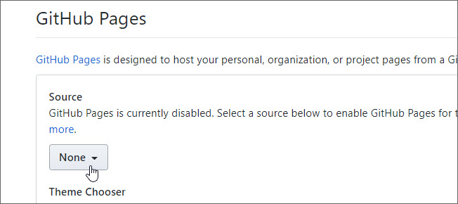
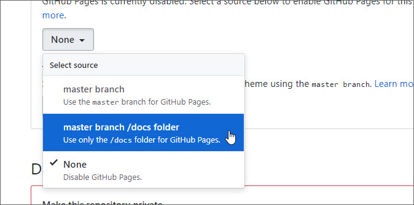
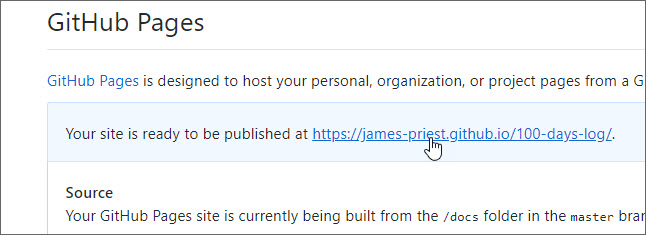

# 100 Days Log Template<!-- omit in toc -->

This repo is used to track progress for Alexander Kallaway's 100 Days of Code Challenge ([https://100daysofcode.com](https://100daysofcode.com)).

It's made available to anyone that would like to fork this repo in order to also track their progress using GitHub Pages. It uses a customized version of the [Leap day theme](https://github.com/pages-themes/leap-day) (see preview [here](https://pages-themes.github.io/leap-day/)) and allows simple customization of page titles & colors schemes.

- [Overview](#overview)
- [Getting Started](#getting-started)
  - [Prerequisites](#prerequisites)
  - [Installation](#installation)
- [Usage](#usage)
  - [Serve site](#serve-site)
  - [Serve site (with with live-reload)](#serve-site-with-with-live-reload)
- [Deployment](#deployment)
- [Enable GitHub Pages](#enable-github-pages)
- [Optimize Images](#optimize-images)
  - [Grunt Install](#grunt-install)
  - [Grunt Usage](#grunt-usage)
  - [Embedding Images in Log](#embedding-images-in-log)
- [Log Customization](#log-customization)
- [Miscellaneous](#miscellaneous)
  - [Recommended Workflow](#recommended-workflow)
  - [Under the Hood](#under-the-hood)

## Overview

GitHub Pages is a static site hosting service provided by GitHub that takes Markdown files, combines them with a template, and turns them to static HTML.

With GitHub Pages enabled, code logs written in Markdown are converted to html when pushed to GitHub.

## Getting Started

GitHub Pages uses [Jekyll](https://jekyllrb.com/) to build the static site. Jekyll is a Ruby-based static site generator that uses [Liquid](https://jekyllrb.com/docs/liquid/) as it's templating language and Markdown as it's content source. Code logs are written in Markdown.

In order to preview and test changes, Jekyll GitHub Pages  should be installed locally. GitHub recommends installing Jekyll to preview your site and help troubleshoot any failed Jekyll builds.

While Jekyll relies on Ruby and Liquid for logic and templating, you don't need to know anything other than Markdown in order to create your log. Here are a couple Markdown resources.

- [GitHub Guides Mastering Markdown](https://guides.github.com/features/mastering-markdown/)
- [Markdown Syntax Cheatsheet](https://guides.github.com/pdfs/markdown-cheatsheet-online.pdf)

### Prerequisites

[Ruby](https://www.ruby-lang.org/) and [Bundler](http://bundler.io/) need to be installed before proceeding.

1. Open the terminal (Terminal, Git Bash, WSL, etc.).
2. Check whether you have Ruby 2.1.0 or higher installed:

   ```bash
   $ruby --version
   > ruby 2.X.X
   ```

3. If you don't have Ruby installed, [install Ruby 2.1.0 or higher](https://www.ruby-lang.org/en/downloads/).
4. Install Bundler:

   ```bash
   $ gem install bundler
   # Installs the Bundler gem
   ```

### Installation

Fork and clone the repo, then use Bundler to install the gem dependencies.

1. Fork the repo by clicking the Fork button in the upper right corner of the page.

    

2. Clone (or download) the repo.

    ```bash
    $ git clone https://github.com/<username>/100-days-log.git
    $ cd 100-days-log/docs/
    >
    ```

3. Install Jekyll and other [dependencies](https://pages.github.com/versions/) from the GitHub Pages gem with the following command.

    ```bash
    $ bundle install
    > Fetching gem metadata from https://rubygems.org/............
    > Fetching version metadata from https://rubygems.org/...
    > Fetching dependency metadata from https://rubygems.org/..
    > Resolving dependencies...

## Usage

You can serve the site and enable live-reload if desired. [Additional command line options](https://jekyllrb.com/docs/configuration/options/) exist to changes things such as port, hostname, url, etc.

### Serve site

Serves the local Jekyll site and rebuilds anytime a source file changes.

1. Navigate to the `docs` folder off of the root directory.
2. Run the Jekyll site locally.

    ```bash
    bundle exec jekyll serve
    ```

3. Preview your local Jekyll site in your web browser at

     [http://localhost:4000](http://localhost:4000)

### Serve site (with with live-reload)

Serves, builds and auto-reloads the page when whenever a source file changes.

1. Navigate to the `docs` folder off of the root directory.
2. Run the Jekyll site locally.

    ```bash
    bundle exec jekyll serve --livereload
    ```

3. Preview your local Jekyll site in your web browser at

     [http://localhost:4000](http://localhost:4000)

## Deployment

Once all changes are completed and you are satisfied that everything looks fine, the site can be deployed to GitHub with a commit and push.

1. Add all files to staging.

    ```bash
    git add .
    ```

2. Commit with a meaningful message such as "Day 1: Title of my first entry" or "r1d1: What I did today".

    ```bash
    git commit -m "Day 1: Deploy new log"
    ```

3. Push changes to GitHub

    ```bash
    git push
    ```

Once the changes are posted it takes GitHub 1-3 minutes to generate the site.

## Enable GitHub Pages

In order to view your site you'll need to go into your repository's Settings and enable GitHub Pages.

1. Choose Settings from repo menu.

    

2. Click the button under Source.

    

3. Choose "master branch /docs folder".

    

    This will refresh the page and start the build process. There is no need to choose a theme since this will be picked up from the `_config.yml` file.

4. You can navigate back down to the GitHub Pages section to view or click the link to the new site. This might take a minute or two to generate.

    

## Optimize Images

A grunt task is provided that will monitor a "watch folder" and create optimized versions of any image files copied to that folder. This works for both JPGs and PNGs. and will help keep file sizes small for a log that may eventually contain 100+ images.

The files will be sized at:

- small (570 width)
- large (800 width)

The small image is sized to display properly within the template's page width. The large image is used as an expanded view if a user clicks on the small image. Both are optimized for size.

Once the Grunt task is running, any image copied to source will be optimized and place in output. Here are the source and output folder paths.

| Source folder | Output folder |
| --- | --- |
| `/docs/src/images/` | `/docs/assets/images/` |

An image named `my-file.jpg` will be created as follows.

| source | small output (570w) | large output (800w) |
| --- | --- | --- |
| /docs/src/images/my-file.jpg | /docs/assets/images/my-file_small.jpg | /docs/assets/images/my-file.jpg |

The images can then be linked to in the output directory from the code log.

### Grunt Install

Run once to install package dependencies.

1. Navigate to the `docs` folder off of the root directory.
2. Install npm dependencies.

    ```bash
    npm install
    ```

### Grunt Usage

Run each time to enable image optimization with watch folder.

1. Navigate to the `docs` folder off of the root directory.
2. Run grunt .

    ```bash
    npx grunt
    ```

### Embedding Images in Log

Use this format to embed a **simple, non-clickable** image.

```bash

```

Use this format to embed a **clickable image** which displays a larger version on click.

```bash
[](assets/images/my-file.jpg)
```

## Log Customization

THIS SECTION IS A WIP... and still needs to be completed.

This is a list of items that can be customized at the top of each page.

- Header text
- Header description
- Header background color
- Page background color
- Link color

These items can be customized for the site.

- Favicon - replace icon in `docs/assets/images/icons/favicon.ico`
- Heading text for default page - `/_config.yml`

## Miscellaneous

### Recommended Workflow

- VSCode extensions that I use for my log.
  - Code Spell Checker
  - Markdown All in Once
  - Markdown Emoji
  - Markdown Preview Git
  - markdownlint

<!-- 
1. Open folder
2. Start up site in terminal
3. Make changes
4. other... -->

### Under the Hood

Here's how a sample set of Markdown files would be converted.

- README.md -> index.html
- log1.md -> log1.html
- log2.md -> log2.html
- notes.md -> notes.html

Initially all log files are placed in the `/docs` folder. This will create the html files in the root of your GitHub Pages repo site.

It is possible to create a folder structure to hold additional Markdown files. These would then be converted to HTML and hosted on GitHub Pages.

Here's the mapping.

| GitHub Repo source | GitHub Pages URL |
| --- | --- |
| `https://github.com/<username>/100-days-log/docs/` | `https://<username>.github.io/100-days-log/` |

Here are some paths and their URL mapping.

| GitHub Repo source | GitHub Pages URL |
| --- | --- |
| `/docs/README.md` | `https://<username>.github.io/100-days-log/index.html` |
| `/docs/log1.md` | `https://<username>.github.io/100-days-log/log1.html` |
| `/docs/my-notes.md` | `https://<username>.github.io/100-days-log/my-notes.html` |
| `/docs/logs/page1.md` | `https://<username>.github.io/100-days-log/logs/page1.html` |
| `/docs/school-notes/cs101.md` | `https://<username>.github.io/100-days-log/school-notes/cs101.html` |

