<!-- markdownlint-disable MD022 MD024 MD025 MD032 MD033 -->

# James Priest
<p class="toc"><a href="./index.html">&lt;– back to Table of Contents</a></p>

## 100 Days of Code

| Log 1 | Log 2 | Log 3 | Log 4 | Log 5 |
| --- | --- | --- | --- | --- |
| [Round 1](https://james-priest.github.io/100-days-of-code-log/) | [Round 2](https://james-priest.github.io/100-days-of-code-log-r2/) | [Round 3](https://james-priest.github.io/100-days-of-code-log-r3/) | [Round 4](https://james-priest.github.io/100-days-of-code-log-r4/) | this log |

## Challenge & Commitment
This is part of Alexander Kallaway's [100DaysOfCode](https://github.com/Kallaway/100-days-of-code "the official repo") challenge. More details about the challenge can be found here: [100daysofcode.com](http://100daysofcode.com/ "100daysofcode.com").

**Commitment:** *I will code daily for the next 100 days.*

|  Start Date   | End Date     |
| ------------- | ------------ |
| February 25, 2019  | - - - |

## Goals

- [x] Code daily
- [x] Successfully complete Udacity's [React Nanodegree](https://www.udacity.com/course/react-nanodegree--nd019) program

# Code Log

---

## 58. React Native Explained
### Day 58: April 28, 2019 - Sunday

**Project:** [Udacity React Nanodegree Program](https://www.udacity.com/course/react-nanodegree--nd019)

[](https://james-priest.github.io/udacity-nanodegree-react/assets/images/rn3.jpg)<br>
<span class="center bold">React Native code</span>

**Progress:** Continued React Native course for my React Nanodegree Program.

This section discussed the ways in which React and React Native share similarities.

Some of the benefits include:

- Leverage JavaScript & React to build apps for both iOS & Android
- Ability to have a single team write for both iOS & Android platforms
- Ability for RN apps to compile down to native app code

You can read more here: [Udacity React Native - 1.2 What is React Native](https://james-priest.github.io/udacity-nanodegree-react/course-notes/react-native.html#12-what-is-react-native)

**Links:**
- Course notes - [Udacity React Native](https://james-priest.github.io/udacity-nanodegree-react/course-notes/react-native.html)
- Link to [Udacity React Nanodegree Program](https://www.udacity.com/course/react-nanodegree--nd019)

---

## 57. React Native
### Day 57: April 27, 2019 - Saturday

**Project:** [Udacity React Nanodegree Program](https://www.udacity.com/course/react-nanodegree--nd019)

[](https://james-priest.github.io/udacity-nanodegree-react/assets/images/rn2.jpg)<br>
<span class="center bold">React Native</span>

**Progress:** Started React Native course for my React Nanodegree Program.

Today covered what the React Native course would consist of including:

- Dev environment setup
- Ideological & API differences from React
- Styling & layout patterns
- Routing patterns
- Native functionality

You can read more here: [Udacity React Native - 1.1 Course Intro](https://james-priest.github.io/udacity-nanodegree-react/course-notes/react-native.html#1-react-native)

**Links:**
- Course notes - [Udacity React Native](https://james-priest.github.io/udacity-nanodegree-react/course-notes/react-native.html)
- Link to [Udacity React Nanodegree Program](https://www.udacity.com/course/react-nanodegree--nd019)

---

## 56. React/Redux Polling App Project Completed
### Day 56: April 26, 2019 - Friday

**Project:** [Udacity React Nanodegree Program](https://www.udacity.com/course/react-nanodegree--nd019)

[](https://james-priest.github.io/assets/images/wyr77.jpg)<br>
<span class="center bold">App Screenshots</span>

**Progress:** Completed React/Redux project for my React Nanodegree Program.

I completed and cleaned-up the code to be able to submit this project. Last minute items including:

- Checked functionality against requirements & rubric
- Removed all debug & console.log() code
- Updated README & documentation & posted to GitHub

[](https://james-priest.github.io/assets/images/wyr75.jpg)<br>
<span class="center bold">Project Submission Results</span>

You can read more here: [ReactND Project 2 - Would You Rather - 5. Project Submission](https://james-priest.github.io/reactnd-project-would-you-rather/#5-project-submission)

**Links:**
- Live Demo: [Would You Rather on Netlify](https://reactnd-would-you-rather.netlify.com/)
- CodeSandbox: [Would You Rather App@13-application-design](https://codesandbox.io/s/github/james-priest/reactnd-project-would-you-rather/tree/13-application-design/?fontsize=14)
- Code notes - [ReactND Project 2 - Would You Rather](https://james-priest.github.io/reactnd-project-would-you-rather/)
- Course notes - [Udacity React & Redux](https://james-priest.github.io/udacity-nanodegree-react/course-notes/react-redux.html#react--redux)
- Link to [Udacity React Nanodegree Program](https://www.udacity.com/course/react-nanodegree--nd019)

---

## 55. React/Redux Polling App No Match 404 Route
### Day 55: April 25, 2019 - Thursday

**Project:** [Udacity React Nanodegree Program](https://www.udacity.com/course/react-nanodegree--nd019)

[](https://james-priest.github.io/assets/images/wyr73.jpg)<br>
<span class="center bold">No Match on bad path</span>

**Progress:** Continued React/Redux project for my React Nanodegree Program.

Today I wrapped up the final required piece for my project submission. This involved the following.

- Creating a NoMatch component
- Updating Routing in App
- Using React Router Redirect on bad id matches

[](https://james-priest.github.io/assets/images/wyr74.jpg)<br>
<span class="center bold">No Match on bad id</span>

You can read more here: [ReactND Project 2 - Would You Rather - 4.13 No Match 404 Routing](https://james-priest.github.io/reactnd-project-would-you-rather/#413-no-match-404-routing)

**Links:**
- Live Demo: [Would You Rather on Netlify](https://reactnd-would-you-rather.netlify.com/)
- CodeSandbox: [Would You Rather App@13-application-design](https://codesandbox.io/s/github/james-priest/reactnd-project-would-you-rather/tree/13-application-design/?fontsize=14)
- Code notes - [ReactND Project 2 - Would You Rather](https://james-priest.github.io/reactnd-project-would-you-rather/)
- Course notes - [Udacity React & Redux](https://james-priest.github.io/udacity-nanodegree-react/course-notes/react-redux.html#react--redux)
- Link to [Udacity React Nanodegree Program](https://www.udacity.com/course/react-nanodegree--nd019)

---

## 54. React/Redux Polling App Leaderboard View
### Day 54: April 24, 2019 - Wednesday

**Project:** [Udacity React Nanodegree Program](https://www.udacity.com/course/react-nanodegree--nd019)

[](https://james-priest.github.io/assets/images/wyr72.jpg)<br>
<span class="center bold">Leaderboard View</span>

**Progress:** Continued React/Redux project for my React Nanodegree Program.

I completed the Leaderboard view which had a long chain of data transformations including:

- Object.values()
- map()
- sort()
- reverse()
- slice()

You can read more here: [ReactND Project 2 - Would You Rather - 4.12 Display Leaderboard](https://james-priest.github.io/reactnd-project-would-you-rather/#412-display-leaderboard)

**Links:**
- Live Demo: [Would You Rather on Netlify](https://reactnd-would-you-rather.netlify.com/)
- CodeSandbox: [Would You Rather App@13-application-design](https://codesandbox.io/s/github/james-priest/reactnd-project-would-you-rather/tree/13-application-design/?fontsize=14)
- Code notes - [ReactND Project 2 - Would You Rather](https://james-priest.github.io/reactnd-project-would-you-rather/)
- Course notes - [Udacity React & Redux](https://james-priest.github.io/udacity-nanodegree-react/course-notes/react-redux.html#react--redux)
- Link to [Udacity React Nanodegree Program](https://www.udacity.com/course/react-nanodegree--nd019)

---

## 53. React/Redux Polling App Create New Poll
### Day 53: April 23, 2019 - Tuesday

**Project:** [Udacity React Nanodegree Program](https://www.udacity.com/course/react-nanodegree--nd019)

[](https://james-priest.github.io/assets/images/wyr67.jpg)<br>
<span class="center bold">Create New Poll View</span>

**Progress:** Continued React/Redux project for my React Nanodegree Program.

This part of the app required new actions, action creators, reducers, & a thunk middleware function. The app now does the following:

- Updates *users* state
- Updates *questions* state
- Does async request to the DB

Here are the logger results showing the dispatched action.

[](https://james-priest.github.io/assets/images/wyr71.jpg)<br>
<span class="center bold">Redux Logger</span>

You can read more here: [ReactND Project 2 - Would You Rather - 4.11 Create New Poll](https://james-priest.github.io/reactnd-project-would-you-rather/#411-create-new-poll)

**Links:**
- Live Demo: [Would You Rather on Netlify](https://reactnd-would-you-rather.netlify.com/)
- CodeSandbox: [Would You Rather App@13-application-design](https://codesandbox.io/s/github/james-priest/reactnd-project-would-you-rather/tree/13-application-design/?fontsize=14)
- Code notes - [ReactND Project 2 - Would You Rather](https://james-priest.github.io/reactnd-project-would-you-rather/)
- Course notes - [Udacity React & Redux](https://james-priest.github.io/udacity-nanodegree-react/course-notes/react-redux.html#react--redux)
- Link to [Udacity React Nanodegree Program](https://www.udacity.com/course/react-nanodegree--nd019)

---

## 52. React/Redux Polling App Display Poll Results
### Day 52: April 22, 2019 - Monday

**Project:** [Udacity React Nanodegree Program](https://www.udacity.com/course/react-nanodegree--nd019)

[](https://james-priest.github.io/assets/images/wyr65.jpg)<br>
<span class="center bold">Poll Results View</span>

**Progress:** Continued React/Redux project for my React Nanodegree Program.

I connected the PollResult component to the Redux store in order to pull necessary data to do poll calculations.

These include:

- total number of votes
- number of votes for each option
- percentage of total vote for each option
- indication of which option user voted for

Code handles cases of a ties and leaves both options with secondary styling.

[](https://james-priest.github.io/assets/images/wyr66.jpg)<br>
<span class="center bold">Poll Results with a tie</span>

You can read more here: [ReactND Project 2 - Would You Rather - 4.10 Display Poll Results](https://james-priest.github.io/reactnd-project-would-you-rather/#410-display-poll-results)

**Links:**
- Live Demo: [Would You Rather on Netlify](https://reactnd-would-you-rather.netlify.com/)
- CodeSandbox: [Would You Rather App@13-application-design](https://codesandbox.io/s/github/james-priest/reactnd-project-would-you-rather/tree/13-application-design/?fontsize=14)
- Code notes - [ReactND Project 2 - Would You Rather](https://james-priest.github.io/reactnd-project-would-you-rather/)
- Course notes - [Udacity React & Redux](https://james-priest.github.io/udacity-nanodegree-react/course-notes/react-redux.html#react--redux)
- Link to [Udacity React Nanodegree Program](https://www.udacity.com/course/react-nanodegree--nd019)

---

## 51. React/Redux Polling App Answer Poll Question
### Day 51: April 21, 2019 - Sunday

**Project:** [Udacity React Nanodegree Program](https://www.udacity.com/course/react-nanodegree--nd019)

[](https://james-priest.github.io/assets/images/wyr63.jpg)<br>
<span class="center bold">Answer Question View</span>

**Progress:** Continued React/Redux project for my React Nanodegree Program.

Finished the Answer Poll Question part of the app.  This does the following:

- Updates *users* state
- Updates *questions* state
- Does an async request to the DB

The Redux Logger middleware shows actions submitted and the updated state as a result.

[](https://james-priest.github.io/assets/images/wyr64.jpg)<br>
<span class="center bold">Redux Logger</span>

You can read more here: [ReactND Project 2 - Would You Rather - 4.9 Answer Poll Question](https://james-priest.github.io/reactnd-project-would-you-rather/#49-answer-poll-question)

**Links:**
- Live Demo: [Would You Rather on Netlify](https://reactnd-would-you-rather.netlify.com/)
- CodeSandbox: [Would You Rather App@13-application-design](https://codesandbox.io/s/github/james-priest/reactnd-project-would-you-rather/tree/13-application-design/?fontsize=14)
- Code notes - [ReactND Project 2 - Would You Rather](https://james-priest.github.io/reactnd-project-would-you-rather/)
- Course notes - [Udacity React & Redux](https://james-priest.github.io/udacity-nanodegree-react/course-notes/react-redux.html#react--redux)
- Link to [Udacity React Nanodegree Program](https://www.udacity.com/course/react-nanodegree--nd019)

---

## 50. React/Redux Polling App UserCard Component
### Day 50: April 20, 2019 - Saturday

**Project:** [Udacity React Nanodegree Program](https://www.udacity.com/course/react-nanodegree--nd019)

[](https://james-priest.github.io/assets/images/wyr61.jpg)<br>
<span class="center bold">Refactored UserCard</span>

**Progress:** Continued React/Redux project for my React Nanodegree Program.

The UserCard component is responsible for displaying each of the following components based on the context

- PollTeaser
- PollQuestion
- PollResult

For this reason I needed to refactor the component to better handle each use case

I created a simple switch statement that returns the proper component based on type.

```jsx
const pollTypes = {
  POLL_TEASER: 'POLL_TEASER',
  POLL_QUESTION: 'POLL_QUESTION',
  POLL_RESULT: 'POLL_RESULT'
};

const PollContent = props => {
  const { pollType, question, unanswered } = props;

  switch (pollType) {
    case pollTypes.POLL_TEASER:
      return <PollTeaser question={question} unanswered={unanswered} />;
    case pollTypes.POLL_QUESTION:
      return <PollQuestion question={question} />;
    case pollTypes.POLL_RESULT:
      return <PollResult question={question} />;
    default:
      return;
  }
};
```

Then the component is referenced by the following:

```html
<PollContent pollType={pollType} question={question} unanswered={unanswered} />
```

You can read more here: [ReactND Project 2 - Would You Rather - 4.8 UserCard Component](https://james-priest.github.io/reactnd-project-would-you-rather/#48-usercard-component)

**Links:**
- Live Demo: [Would You Rather on Netlify](https://reactnd-would-you-rather.netlify.com/)
- CodeSandbox: [Would You Rather App@13-application-design](https://codesandbox.io/s/github/james-priest/reactnd-project-would-you-rather/tree/13-application-design/?fontsize=14)
- Code notes - [ReactND Project 2 - Would You Rather](https://james-priest.github.io/reactnd-project-would-you-rather/)
- Course notes - [Udacity React & Redux](https://james-priest.github.io/udacity-nanodegree-react/course-notes/react-redux.html#react--redux)
- Link to [Udacity React Nanodegree Program](https://www.udacity.com/course/react-nanodegree--nd019)

---

## 49. React/Redux Polling App Home View
### Day 49: April 19, 2019 - Friday

**Project:** [Udacity React Nanodegree Program](https://www.udacity.com/course/react-nanodegree--nd019)

[](https://james-priest.github.io/assets/images/wyr60.jpg)<br>
<span class="center bold">Home View</span>

**Progress:** Continued React/Redux project for my React Nanodegree Program.

This section required work on three separate components.

- Home
- UserCard
- PollTeaser

Both Home and UserCard were connected up to the Redux store in order to map our state to props for display.

The most involved transformation of involved taking state as an object, turning into an array, filtering that array, and then sorting it chronologically.

This was done to our question data prior to being used in our `connect` method.

```js
function mapStateToProps({ authUser, users, questions }) {
  const answeredIds = Object.keys(users[authUser].answers);
  const answered = Object.values(questions)
    .filter(question => answeredIds.includes(question.id))
    .sort((a, b) => b.timestamp - a.timestamp);
  const unanswered = Object.values(questions)
    .filter(question => !answeredIds.includes(question.id))
    .sort((a, b) => b.timestamp - a.timestamp);

  return {
    userQuestionData: {
      answered,
      unanswered
    }
  };
}
```

You can read more here: [ReactND Project 2 - Would You Rather - 4.7 Home View](https://james-priest.github.io/reactnd-project-would-you-rather/#47-home-view)

**Links:**
- Live Demo: [Would You Rather on Netlify](https://reactnd-would-you-rather.netlify.com/)
- CodeSandbox: [Would You Rather App@13-application-design](https://codesandbox.io/s/github/james-priest/reactnd-project-would-you-rather/tree/13-application-design/?fontsize=14)
- Code notes - [ReactND Project 2 - Would You Rather](https://james-priest.github.io/reactnd-project-would-you-rather/)
- Course notes - [Udacity React & Redux](https://james-priest.github.io/udacity-nanodegree-react/course-notes/react-redux.html#react--redux)
- Link to [Udacity React Nanodegree Program](https://www.udacity.com/course/react-nanodegree--nd019)

---

## 48. React/Redux Polling App Login & Nav
### Day 48: April 18, 2019 - Thursday

**Project:** [Udacity React Nanodegree Program](https://www.udacity.com/course/react-nanodegree--nd019)

[](https://james-priest.github.io/assets/images/wyr57.jpg)<br>
<span class="center bold">Login Form Component showing user accounts</span>

**Progress:** Continued React/Redux project for my React Nanodegree Program.

This part of the the application dev process consists of creating components around my Redux data.

I started with the Login & Nav components which use the following Redux state entities.

- users
- authUser (Logged in user)

[](https://james-priest.github.io/assets/images/wyr58.jpg)<br>
<span class="center bold">Nav Component showing logged in user</span>

You can read more here: [ReactND Project 2 - Would You Rather - 4.6 Login & Navigation](https://james-priest.github.io/reactnd-project-would-you-rather/#46-login--navigation)

**Links:**
- Live Demo: [Would You Rather on Netlify](https://reactnd-would-you-rather.netlify.com/)
- CodeSandbox: [Would You Rather App@13-application-design](https://codesandbox.io/s/github/james-priest/reactnd-project-would-you-rather/tree/13-application-design/?fontsize=14)
- Code notes - [ReactND Project 2 - Would You Rather](https://james-priest.github.io/reactnd-project-would-you-rather/)
- Course notes - [Udacity React & Redux](https://james-priest.github.io/udacity-nanodegree-react/course-notes/react-redux.html#react--redux)
- Link to [Udacity React Nanodegree Program](https://www.udacity.com/course/react-nanodegree--nd019)

---

## 47. React/Redux Polling App Initial Data Set
### Day 47: April 17, 2019 - Wednesday

**Project:** [Udacity React Nanodegree Program](https://www.udacity.com/course/react-nanodegree--nd019)

[](https://james-priest.github.io/assets/images/wyr55.jpg)<br>
<span class="center bold">React Tools show storeState</span>

**Progress:** Continued React/Redux project for my React Nanodegree Program.

Today I finally hooked up all the Redux plumbing code I had written up until this point by creating an entry point for an action dispatch in my App component. This now brings together each of these parts.

- actions
- action creators
- reducers
- redux middleware
- async API calls

The entry point dispatches my `handleInitialData()` redux thunk action to fill the store with it's initial data set.

You can read more here: [ReactND Project 2 - Would You Rather - 4.5 Initialize App Data](https://james-priest.github.io/reactnd-project-would-you-rather/#45-initialize-app-data)

**Links:**
- Live Demo: [Would You Rather on Netlify](https://reactnd-would-you-rather.netlify.com/)
- CodeSandbox: [Would You Rather App@13-application-design](https://codesandbox.io/s/github/james-priest/reactnd-project-would-you-rather/tree/13-application-design/?fontsize=14)
- Code notes - [ReactND Project 2 - Would You Rather](https://james-priest.github.io/reactnd-project-would-you-rather/)
- Course notes - [Udacity React & Redux](https://james-priest.github.io/udacity-nanodegree-react/course-notes/react-redux.html#react--redux)
- Link to [Udacity React Nanodegree Program](https://www.udacity.com/course/react-nanodegree--nd019)

---

## 46. React/Redux Polling App Middleware & Logging
### Day 46: April 16, 2019 - Tuesday

**Project:** [Udacity React Nanodegree Program](https://www.udacity.com/course/react-nanodegree--nd019)

[](https://james-priest.github.io/assets/images/wyr56.jpg)<br>
<span class="center bold">Dev Tools Console with Logger output</span>

**Progress:** Continued React/Redux project for my React Nanodegree Program.

Today I added a Redux Thunk middleware component that outputs the resulting state of any action dispatches. This makes it a lot easier to do simple state debugging.

This involved the following code at `/src/middleware/logger.js`.

```js
// logger.js
const logger = store => next => action => {
  console.group(action.type);
  console.log('The action:', action);
  const returnValue = next(action);
  console.log('The new state: ', store.getState());
  console.groupEnd();
  return returnValue;
};

export default logger;
```

Then adding the following code at `/src/middleware/index.js`.

```js
// index.js
import thunk from 'redux-thunk';
import logger from './logger';
import { applyMiddleware } from 'redux';

export default applyMiddleware(thunk, logger);
```

Then it was added to the `createStore()` method in `/src/index.js`.

```jsx
// index.js
...
import rootReducer from './reducers/index';
import middleware from './middleware';

const store = createStore(rootReducer, middleware);

ReactDOM.render(
  <Provider store={store}>
    <App />
  </Provider>,
  document.getElementById('root')
);
```

You can read more here: [ReactND Project 2 - Would You Rather - 4.4 Middleware](https://james-priest.github.io/reactnd-project-would-you-rather/#44-middleware)

**Links:**
- Live Demo: [Would You Rather on Netlify](https://reactnd-would-you-rather.netlify.com/)
- CodeSandbox: [Would You Rather App@13-application-design](https://codesandbox.io/s/github/james-priest/reactnd-project-would-you-rather/tree/13-application-design/?fontsize=14)
- Code notes - [ReactND Project 2 - Would You Rather](https://james-priest.github.io/reactnd-project-would-you-rather/)
- Course notes - [Udacity React & Redux](https://james-priest.github.io/udacity-nanodegree-react/course-notes/react-redux.html#react--redux)
- Link to [Udacity React Nanodegree Program](https://www.udacity.com/course/react-nanodegree--nd019)

---

## 45. React/Redux Polling App Actions & Reducers
### Day 45: April 15, 2019 - Monday

**Project:** [Udacity React Nanodegree Program](https://www.udacity.com/course/react-nanodegree--nd019)

[](https://james-priest.github.io/assets/images/wyr54.jpg)<br>
<span class="center bold">React Dev Tools showing store state</span>

**Progress:** Continued React/Redux project for my React Nanodegree Program.

Now that I completed the design and planning phase I was able to finally start the coding phase. The great part is that this is happening quickly and with confidence.

I managed to work on the following:

- Async API calls
- Actions & action creators
- Reducers

You can read more here: [ReactND Project 2 - Would You Rather - 4. Coding Phase](https://james-priest.github.io/reactnd-project-would-you-rather/#4-coding-phase)

**Links:**
- Live Demo: [Would You Rather on Netlify](https://reactnd-would-you-rather.netlify.com/)
- CodeSandbox: [Would You Rather App@13-application-design](https://codesandbox.io/s/github/james-priest/reactnd-project-would-you-rather/tree/13-application-design/?fontsize=14)
- Code notes - [ReactND Project 2 - Would You Rather](https://james-priest.github.io/reactnd-project-would-you-rather/)
- Course notes - [Udacity React & Redux](https://james-priest.github.io/udacity-nanodegree-react/course-notes/react-redux.html#react--redux)
- Link to [Udacity React Nanodegree Program](https://www.udacity.com/course/react-nanodegree--nd019)

---

## 44. React/Redux Polling App Store Data
### Day 44: April 14, 2019 - Sunday

**Project:** [Udacity React Nanodegree Program](https://www.udacity.com/course/react-nanodegree--nd019)

[](https://james-priest.github.io/assets/images/wyr53.jpg)<br>
<span class="center bold">Redux Store Entities</span>

**Progress:** Continued React/Redux project for my React Nanodegree Program.

This last step of the the application design process involves analyzing where each piece of data is required.

Data used globally or in many different places is ideal for our Redux store. One useful exercise is to list out all components that rely on each data entity.

**Component / Store Matrix:** Here's a matrix that shows each proposed component on the left matched with each data entity across the top. It indicates whether that component with use that entity.

| *Components / Data* | Users | Questions | AuthUser| Text | Option |
| | --- | --- | --- | --- | --- |
| App | x | x | | | |
| Login | x | | x | | |
| Home | | x | | | |
| UserCard | x | | | | |
| PollTeaser | | x | | | |
| PollQuestion | x | x | | | x |
| PollAnswer | | x | | | |
| NewPoll | | | x | x | |
| Leaderboard | x | | | | |
| LeaderboardCard | x | | | | |

We can quickly see which components require Users, Questions, & AuthUser. This also tells us which components need to be made into container components and connected with React-Redux.

You can read more here: [ReactND Project 2 - Would You Rather - 3.4 Store Data](https://james-priest.github.io/reactnd-project-would-you-rather/#34-step-4---store-data)

**Links:**
- Live Demo: [Would You Rather on Netlify](https://reactnd-would-you-rather.netlify.com/)
- CodeSandbox: [Would You Rather App@13-application-design](https://codesandbox.io/s/github/james-priest/reactnd-project-would-you-rather/tree/13-application-design/?fontsize=14)
- Code notes - [ReactND Project 2 - Would You Rather](https://james-priest.github.io/reactnd-project-would-you-rather/)
- Course notes - [Udacity React & Redux](https://james-priest.github.io/udacity-nanodegree-react/course-notes/react-redux.html#react--redux)
- Link to [Udacity React Nanodegree Program](https://www.udacity.com/course/react-nanodegree--nd019)

---

## 43. React/Redux Polling App App Events
### Day 43: April 13, 2019 - Saturday

**Project:** [Udacity React Nanodegree Program](https://www.udacity.com/course/react-nanodegree--nd019)

[](https://james-priest.github.io/assets/images/wyr48.jpg)<br>
<span class="center bold">PollQuestion component</span>

**Progress:** Continued React/Redux project for my React Nanodegree Program.

This next step consists of determining what events happen in each component. We do this by taking a look at what can happen in each component. Specifically, what **actions** the app or user is performing on the **data** in each component.

We do the following in the analysis of of each component:

- <span class="underline">underline</span> the action
- **bold** the data

Here's the breakdown for the PollQuestion component from above.

- <span class="underline">get</span> **authUser** to record an answered question.
- <span class="underline">get</span> question from the list of **questions**.
- <span class="underline">set</span> **option** for the answered question.

You can read more here: [ReactND Project 2 - Would You Rather - 3.3 App Events](https://james-priest.github.io/reactnd-project-would-you-rather/#33-step-3---app-events)

**Links:**
- Live Demo: [Would You Rather on Netlify](https://reactnd-would-you-rather.netlify.com/)
- CodeSandbox: [Would You Rather App@13-application-design](https://codesandbox.io/s/github/james-priest/reactnd-project-would-you-rather/tree/13-application-design/?fontsize=14)
- Code notes - [ReactND Project 2 - Would You Rather](https://james-priest.github.io/reactnd-project-would-you-rather/)
- Course notes - [Udacity React & Redux](https://james-priest.github.io/udacity-nanodegree-react/course-notes/react-redux.html#react--redux)
- Link to [Udacity React Nanodegree Program](https://www.udacity.com/course/react-nanodegree--nd019)

---

## 42. React/Redux Polling App Component Hierarchy
### Day 42: April 12, 2019 - Friday

**Project:** [Udacity React Nanodegree Program](https://www.udacity.com/course/react-nanodegree--nd019)

[](https://james-priest.github.io/assets/images/wyr35.jpg)<br>
<span class="center bold">Login components</span>

**Progress:** Continued React/Redux project for my React Nanodegree Program.

Now that the views have been created along with a bullet list of requirements for each, the next step is to create the component hierarchy.

This is done by drawing boxes around every component or sub-component and naming each.

Determining what should be a component should follow the same rules for deciding if a new function or object should be created. It should follow the single responsibility principle. A component should ideally only do one thing.

You can read more here: [ReactND Project 2 - Would You Rather - 3.2 Component Hierarchy](https://james-priest.github.io/reactnd-project-would-you-rather/#32-step-2---component-hierarchy)

**Links:**
- Live Demo: [Would You Rather on Netlify](https://reactnd-would-you-rather.netlify.com/)
- CodeSandbox: [Would You Rather App@13-application-design](https://codesandbox.io/s/github/james-priest/reactnd-project-would-you-rather/tree/13-application-design/?fontsize=14)
- Code notes - [ReactND Project 2 - Would You Rather](https://james-priest.github.io/reactnd-project-would-you-rather/)
- Course notes - [Udacity React & Redux](https://james-priest.github.io/udacity-nanodegree-react/course-notes/react-redux.html#react--redux)
- Link to [Udacity React Nanodegree Program](https://www.udacity.com/course/react-nanodegree--nd019)

---

## 41. React/Redux Polling App Views & Requirements
### Day 41: April 11, 2019 - Thursday

**Project:** [Udacity React Nanodegree Program](https://www.udacity.com/course/react-nanodegree--nd019)

[](assets/images/day41.jpg)<br>
<span class="center bold">Home View</span>

**Progress:** Continued React/Redux project for my React Nanodegree Program.

The next step in building this app is to take each mockup and list out the requirements based on user stories or a narrative.

Here's a list of requirements for the Home view pictured above.

- Upon login the user is take to root (`/`) and shown the Home view
- User can toggle between his/her answered and unanswered polls
- Unanswered polls should be shown by default
- Polls in both categories are arranged from most recent to least recently created
- The logged in account name should be visible on the page
- Clicking any poll (answered or unanswered) navigates to the poll’s details
- Poll details should be located at `questions/:question_id`

You can read more here: [ReactND Project 2 - Would You Rather - 3.1 View Requirements](https://james-priest.github.io/reactnd-project-would-you-rather/#31-step-1---view-requirements)

**Links:**
- Live Demo: [Would You Rather on Netlify](https://reactnd-would-you-rather.netlify.com/)
- CodeSandbox: [Would You Rather App@13-application-design](https://codesandbox.io/s/github/james-priest/reactnd-project-would-you-rather/tree/13-application-design/?fontsize=14)
- Code notes - [ReactND Project 2 - Would You Rather](https://james-priest.github.io/reactnd-project-would-you-rather/)
- Course notes - [Udacity React & Redux](https://james-priest.github.io/udacity-nanodegree-react/course-notes/react-redux.html#react--redux)
- Link to [Udacity React Nanodegree Program](https://www.udacity.com/course/react-nanodegree--nd019)

---

## 40. React/Redux Polling App Login Form
### Day 40: April 10, 2019 - Wednesday

**Project:** [Udacity React Nanodegree Program](https://www.udacity.com/course/react-nanodegree--nd019)

[](https://james-priest.github.io/assets/images/wyr25.jpg)<br>
<span class="center bold">Login</span>

**Progress:** Continued React/Redux project for my React Nanodegree Program.

Today I completed the Login page mockup for this project. It does the following.

- Allows a user to select one of the pre-existing accounts
- Enables the Login button once a selection has been made
- Displays the logged in user within the Navigation bar.

You can read more here: [ReactND Project 2 - Would You Rather - 2.11 Mockup - Login](https://james-priest.github.io/reactnd-project-would-you-rather/#211-mockup---login)

**Links:**
- Live Demo: [Would You Rather on Netlify](https://reactnd-would-you-rather.netlify.com/)
- CodeSandbox: [Would You Rather App@12-mockup-login](https://codesandbox.io/s/github/james-priest/reactnd-project-would-you-rather/tree/12-mockup-login/?fontsize=14)
- Code notes - [ReactND Project 2 - Would You Rather](https://james-priest.github.io/reactnd-project-would-you-rather/)
- Course notes - [Udacity React & Redux](https://james-priest.github.io/udacity-nanodegree-react/course-notes/react-redux.html#react--redux)
- Link to [Udacity React Nanodegree Program](https://www.udacity.com/course/react-nanodegree--nd019)

---

## 39. React/Redux Polling App Leaderboard
### Day 39: April 9, 2019 - Tuesday

**Project:** [Udacity React Nanodegree Program](https://www.udacity.com/course/react-nanodegree--nd019)

[](https://james-priest.github.io/assets/images/wyr24.jpg)<br>
<span class="center bold">Leaderboard</span>

**Progress:** Continued React/Redux project for my React Nanodegree Program.

The leaderboard required some data manipulation in order to do the following

- Get answered questions score
- Get created questions score
- Calculate totals
- Sort by rank

You can read more here: [ReactND Project 2 - Would You Rather - 2.10 Mockup - Leaderboard](https://james-priest.github.io/reactnd-project-would-you-rather/#210-mockup---leaderboard)

**Links:**
- Live Demo: [Would You Rather on Netlify](https://reactnd-would-you-rather.netlify.com/)
- CodeSandbox: [Would You Rather App@11-mockup-leaderboard](https://codesandbox.io/s/github/james-priest/reactnd-project-would-you-rather/tree/11-mockup-leaderboard/?fontsize=14)
- Code notes - [ReactND Project 2 - Would You Rather](https://james-priest.github.io/reactnd-project-would-you-rather/)
- Course notes - [Udacity React & Redux](https://james-priest.github.io/udacity-nanodegree-react/course-notes/react-redux.html#react--redux)
- Link to [Udacity React Nanodegree Program](https://www.udacity.com/course/react-nanodegree--nd019)

---

## 38. React/Redux Polling App New Poll Form
### Day 38: April 8, 2019 - Monday

**Project:** [Udacity React Nanodegree Program](https://www.udacity.com/course/react-nanodegree--nd019)

[](https://james-priest.github.io/assets/images/wyr21.jpg)<br>
<span class="center bold">New Poll Form</span>

**Progress:** Continued React/Redux project for my React Nanodegree Program.

Today I created a controlled component for the Add Poll page.  It does the following.

- Requires each field to have valid data before Submit button is enabled
- Uses state to control field values
- Implements a Loader on submission

You can read more here: [ReactND Project 2 - Would You Rather - 2.9 Mockup - New Poll](https://james-priest.github.io/reactnd-project-would-you-rather/#29-mockup---new-poll)

**Links:**
- Live Demo: [Would You Rather on Netlify](https://reactnd-would-you-rather.netlify.com/)
- CodeSandbox: [Would You Rather App@10-mockup-new-poll](https://codesandbox.io/s/github/james-priest/reactnd-project-would-you-rather/tree/10-mockup-new-poll/?fontsize=14)
- Code notes - [ReactND Project 2 - Would You Rather](https://james-priest.github.io/reactnd-project-would-you-rather/)
- Course notes - [Udacity React & Redux](https://james-priest.github.io/udacity-nanodegree-react/course-notes/react-redux.html#react--redux)
- Link to [Udacity React Nanodegree Program](https://www.udacity.com/course/react-nanodegree--nd019)

---

## 37. React/Redux Polling App Poll Result
### Day 37: April 7, 2019 - Sunday

**Project:** [Udacity React Nanodegree Program](https://www.udacity.com/course/react-nanodegree--nd019)

[](https://james-priest.github.io/assets/images/wyr19.jpg)<br>
<span class="center bold">Poll Result</span>

**Progress:** Continued React/Redux project for my React Nanodegree Program.

Today was spent mocking up the Poll Result page. It does the following

- Displays the winning answer
- Shows the number of votes for each question along with total votes
- Displays a percentage of votes
- Shows which option the user voted for

You can read more here: [ReactND Project 2 - Would You Rather - 2.8 Mockup - Poll Result](https://james-priest.github.io/reactnd-project-would-you-rather/#28-mockup---poll-result)

**Links:**
- Live Demo: [Would You Rather App@9-mockup-poll-result](https://codesandbox.io/s/github/james-priest/reactnd-project-would-you-rather/tree/9-mockup-poll-result/?fontsize=14) on CodeSandbox
- Code notes - [ReactND Project 2 - Would You Rather](https://james-priest.github.io/reactnd-project-would-you-rather/)
- Course notes - [Udacity React & Redux](https://james-priest.github.io/udacity-nanodegree-react/course-notes/react-redux.html#react--redux)
- Link to [Udacity React Nanodegree Program](https://www.udacity.com/course/react-nanodegree--nd019)

---

## 36. React/Redux Polling App Poll Question
### Day 36: April 6, 2019 - Saturday

**Project:** [Udacity React Nanodegree Program](https://www.udacity.com/course/react-nanodegree--nd019)

[](https://james-priest.github.io/assets/images/wyr18.jpg)<br>
<span class="center bold">Poll Question</span>

**Progress:** Continued React/Redux project for my React Nanodegree Program.

I spent the day putting together a working version of the poll question page.

It does the following.

- Displays both question options
- Allows one to be selected
- Submits the selection in order to display the result

You can read more here: [ReactND Project 2 - Would You Rather - 2.7 Mockup - Poll Question](https://james-priest.github.io/reactnd-project-would-you-rather/#27-mockup---poll-question)

**Links:**
- Live Demo: [Would You Rather App@8-mockup-poll-question](https://codesandbox.io/s/github/james-priest/reactnd-project-would-you-rather/tree/8-mockup-poll-question/?fontsize=14) on CodeSandbox
- Code notes - [ReactND Project 2 - Would You Rather](https://james-priest.github.io/reactnd-project-would-you-rather/)
- Course notes - [Udacity React & Redux](https://james-priest.github.io/udacity-nanodegree-react/course-notes/react-redux.html#react--redux)
- Link to [Udacity React Nanodegree Program](https://www.udacity.com/course/react-nanodegree--nd019)

---

## 35. React/Redux Polling App Framework/Stub Pages
### Day 35: April 5, 2019 - Friday

**Project:** [Udacity React Nanodegree Program](https://www.udacity.com/course/react-nanodegree--nd019)

[](https://james-priest.github.io/assets/images/wyr16.jpg)<br>
<span class="center bold">New Poll Stub Page</span>

[](https://james-priest.github.io/assets/images/wyr17.jpg)<br>
<span class="center bold">Leaderboard Stub Page</span>

**Progress:** Continued React/Redux project for my React Nanodegree Program.

I spent the last couple days creating a mockup framework for this app. It now allows navigation and contains a stub view for each page.

This a little time-consuming since I had to do the following

- Add and implement routing
- Organize reusable component structure
- Create stub pages for each view

I also updated the UI scheme a bit to differentiate between answered and unanswered polls.

You can read more here: [ReactND Project 2 - Would You Rather - 2.6 Mockup - Framework](https://james-priest.github.io/reactnd-project-would-you-rather/#26-mockup---framework)

**Links:**
- Live Demo: [Would You Rather App@7-mockup-framework](https://codesandbox.io/s/github/james-priest/reactnd-project-would-you-rather/tree/7-mockup-framework/?fontsize=14) on CodeSandbox
- Code notes - [ReactND Project 2 - Would You Rather](https://james-priest.github.io/reactnd-project-would-you-rather/)
- Course notes - [Udacity React & Redux](https://james-priest.github.io/udacity-nanodegree-react/course-notes/react-redux.html#react--redux)
- Link to [Udacity React Nanodegree Program](https://www.udacity.com/course/react-nanodegree--nd019)

---

## 34. React/Redux Polling App Nav & Tab Component
### Day 34: April 3, 2019 - Wednesday

**Project:** [Udacity React Nanodegree Program](https://www.udacity.com/course/react-nanodegree--nd019)

[](https://james-priest.github.io/assets/images/wyr11.jpg)<br>
<span class="center bold">Home Page with Tab Component Mockup</span>

**Progress:** Continued React/Redux project for my React Nanodegree Program.

Today I cleaned up the Home Page mockup by splitting the UI into the  following components.

- App.js
- Home.js
- Nav.js
- TabControl.js
- Question.js

I then composed these together and used a JavaScript object to mimic the data that Redux will eventually return.

You can read more here: [ReactND Project 2 - Would You Rather - 2.4 Mockup - Home](https://james-priest.github.io/reactnd-project-would-you-rather/#24-mockup---nav)

**Links:**
- Live Demo: [Would You Rather App@6-mockup-home](https://codesandbox.io/s/github/james-priest/reactnd-project-would-you-rather/tree/6-mockup-home/?fontsize=14) on CodeSandbox
- Code notes - [ReactND Project 2 - Would You Rather](https://james-priest.github.io/reactnd-project-would-you-rather/)
- Course notes - [Udacity React & Redux](https://james-priest.github.io/udacity-nanodegree-react/course-notes/react-redux.html#react--redux)
- Link to [Udacity React Nanodegree Program](https://www.udacity.com/course/react-nanodegree--nd019)

---

## 33. React/Redux Polling App Home Page Mockup
### Day 33: April 2, 2019 - Tuesday

**Project:** [Udacity React Nanodegree Program](https://www.udacity.com/course/react-nanodegree--nd019)

[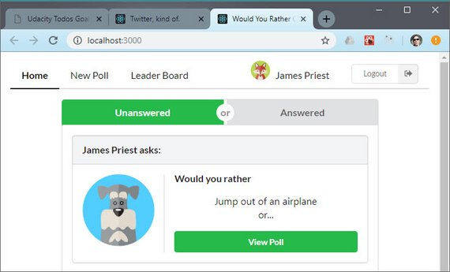](assets/images/day33.jpg)<br>
<span class="center bold">Home Page Mockup</span>

**Progress:** Continued React/Redux project for my React Nanodegree Program.

Today I used the Semantic UI React library to begin mocking up my UI.

I did the following.

- Created a Nav component
- Made sure it was responsive and worked across various breakpoints & sizes
- Mocked up the Home Page using my Nav component and composing sections

You can read more here: [ReactND Project 2 - Would You Rather - 2.3 UI Mockups](https://james-priest.github.io/reactnd-project-would-you-rather/#23-ui-mockups)

**Links:**
- Live Demo: [Would You Rather App@4-ui-mockups](https://codesandbox.io/s/github/james-priest/reactnd-project-would-you-rather/tree/4-ui-mockups/?fontsize=14) on CodeSandbox
- Code notes - [ReactND Project 2 - Would You Rather](https://james-priest.github.io/reactnd-project-would-you-rather/)
- Course notes - [Udacity React & Redux](https://james-priest.github.io/udacity-nanodegree-react/course-notes/react-redux.html#react--redux)
- Link to [Udacity React Nanodegree Program](https://www.udacity.com/course/react-nanodegree--nd019)

---

## 32. React/Redux Polling App Semantic UI React
### Day 32: April 1, 2019 - Monday

**Project:** [Udacity React Nanodegree Program](https://www.udacity.com/course/react-nanodegree--nd019)

[](https://james-priest.github.io/reactnd-project-would-you-rather/assets/images/wyr8.jpg)<br>
<span class="center bold">UI Test 2</span>

**Progress:** Continued React/Redux project for my React Nanodegree Program.

I started with the planning stage of evaluating different React UI Libraries for my UI Framework. I settled on [Sematic UI React](https://react.semantic-ui.com/).

It has awesome docs with examples and code for every component. Each example is done with an embedded CodeSandbox instance so you can instantly tweak the code.

Here's the short list of features.

- jQuery Free
- Declarative API
- Augmentation
- Shorthand Props
- Sub Components
- Auto Controlled State

I created a couple UI test samples to play with the library and have found it to be very flexible

[](https://james-priest.github.io/reactnd-project-would-you-rather/assets/images/wyr7.jpg)<br>
<span class="center bold">UI Test 1</span>

You can see the code I used in my code notes.

You can read more here: [ReactND Project 2 - Would You Rather - 2.1 Sematic UI React](https://james-priest.github.io/reactnd-project-would-you-rather/#21-semantic-ui-react)

**Links:**
- Code notes - [ReactND Project 2 - Would You Rather](https://james-priest.github.io/reactnd-project-would-you-rather/)
- Course notes - [Udacity React & Redux](https://james-priest.github.io/udacity-nanodegree-react/course-notes/react-redux.html#react--redux)
- Link to [Udacity React Nanodegree Program](https://www.udacity.com/course/react-nanodegree--nd019)

---

## 31. React/Redux Polling App Sample UI
### Day 31: March 31, 2019 - Sunday

**Project:** [Udacity React Nanodegree Program](https://www.udacity.com/course/react-nanodegree--nd019)

[](https://james-priest.github.io/reactnd-project-would-you-rather/assets/images/wyr4.jpg)<br>
<span class="center bold">Poll Results</span>

**Progress:** Continued React/Redux project for my React Nanodegree Program.

I added to the requirements portion of my Code Notes by including the following:

- App Functionality
- App Architecture
- Project Instructions
- Sample Project UI
- Step-by-Step Guide

Included are screenshots of a sample version of the "Would You Rather" app.

This helps to show some of the functionality and information that this app needs to have.

[](https://james-priest.github.io/reactnd-project-would-you-rather/assets/images/wyr6.jpg)<br>
<span class="center bold">Leader Board</span>

I also added a section with step-by-step instructions which detail how to design the structure of a React/Redux app.

You can read more here: [ReactND Project 2 - Would You Rather - 1.5 Sample Project UI](https://james-priest.github.io/reactnd-project-would-you-rather/#15-sample-project-ui)

**Links:**
- Code notes - [ReactND Project 2 - Would You Rather](https://james-priest.github.io/reactnd-project-would-you-rather/)
- Course notes - [Udacity React & Redux](https://james-priest.github.io/udacity-nanodegree-react/course-notes/react-redux.html#react--redux)
- Link to [Udacity React Nanodegree Program](https://www.udacity.com/course/react-nanodegree--nd019)

---

## 30. React/Redux Polling App Specifications
### Day 30: March 30, 2019 - Saturday

**Project:** [Udacity React Nanodegree Program](https://www.udacity.com/course/react-nanodegree--nd019)

[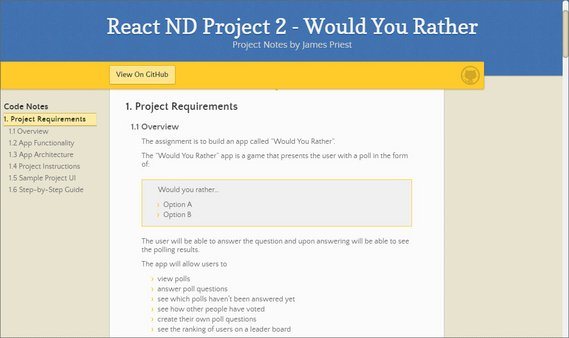](assets/images/day30.jpg)<br>
<span class="center bold">Project Requirement docs</span>

**Progress:** Started React/Redux project for my React Nanodegree Program.

Today was the first day of planning for the "Would You Rather" React/Redux polling application.

This app is to be built from scratch and is required to graduate. It must demonstrate mastery of the following.

- React
- Redux
- React Router
- Redux Thunk & Middleware

Today I spent time covering the project requirements by detailing these in my notes.

You can read more: [ReactND Project 2 - Would You Rather - 1. Project Requirements](https://james-priest.github.io/reactnd-project-would-you-rather/)

**Links:**
- Code notes - [ReactND Project 2 - Would You Rather](https://james-priest.github.io/reactnd-project-would-you-rather/)
- Course notes - [Udacity React & Redux](https://james-priest.github.io/udacity-nanodegree-react/course-notes/react-redux.html#react--redux)
- Link to [Udacity React Nanodegree Program](https://www.udacity.com/course/react-nanodegree--nd019)

---

## 29. Twitter Redux App Done
### Day 29: March 29, 2019 - Friday

**Project:** [Udacity React Nanodegree Program](https://www.udacity.com/course/react-nanodegree--nd019)

[](https://james-priest.github.io/udacity-nanodegree-react/assets/images/rr80.jpg)<br>
**Live Demo:** [Chirper - Redux Twitter@11-react-router](https://codesandbox.io/s/github/james-priest/reactnd-redux-twitter/tree/11-react-router) on CodeSandbox

**Progress:** Continued Udacity Redux lesson for my React Nanodegree Program.

Today I finished my "real-world" Twitter-like app. It employed the following.

- React
- Redux
- React Router
- Redux Thunk

Today's lesson involved implementing React Router across the views and hooking up the child components work with router.

Now that this exercise is done, I should have the required skills to complete my required 2nd React Nanodegree project. The suggested due date was last week so I hope I'm able to knock it out in the next 5-7 days.

You can read more in my notes: [Udacity React & Redux - 7.17 Using React Router](https://james-priest.github.io/udacity-nanodegree-react/course-notes/react-redux.html#717-using-react-router)

**Links:**
- Live Demo - [Chirper - Redux Twitter@11-react-router](https://codesandbox.io/s/github/james-priest/reactnd-redux-twitter/tree/11-react-router) on CodeSandbox
- GitHub Repo - [Chirper - Redux Twitter-like App](https://github.com/james-priest/reactnd-redux-twitter)
- Course notes - [Udacity React & Redux](https://james-priest.github.io/udacity-nanodegree-react/course-notes/react-redux.html#react--redux)
- Link to [Udacity React Nanodegree Program](https://www.udacity.com/course/react-nanodegree--nd019)

---

## 28. Container Component
### Day 28: March 28, 2019 - Thursday

**Project:** [Udacity React Nanodegree Program](https://www.udacity.com/course/react-nanodegree--nd019)

[](https://james-priest.github.io/udacity-nanodegree-react/assets/images/rr77.jpg)<br>
**Live Demo:** [Chirper - Redux Twitter@10-tweet-page](https://codesandbox.io/s/github/james-priest/reactnd-redux-twitter/tree/10-tweet-page) on CodeSandbox

**Progress:** Continued Udacity Redux lesson for my React Nanodegree Program.

Now that I have a few components such as Dashboard, Tweet, & AddTweet, I can begin to compose them in my TweetPage container component.

The Tweet Page displays

- The tweet that has been selected
- An input to reply to the selected tweet
- List of existing replies

Since the actions, action creators, and reducers already exist for my child components it was a matter of fine-tuning the children to work in different contexts.

You can read more in my notes: [Udacity React & Redux - 7.16 TweetPage Component](https://james-priest.github.io/udacity-nanodegree-react/course-notes/react-redux.html#716-tweetpage-component)

**Links:**
- Live Demo - [Chirper - Redux Twitter@10-tweet-page](https://codesandbox.io/s/github/james-priest/reactnd-redux-twitter/tree/10-tweet-page) on CodeSandbox
- GitHub Repo - [Chirper - Redux Twitter-like App](https://github.com/james-priest/reactnd-redux-twitter)
- Course notes - [Udacity React & Redux](https://james-priest.github.io/udacity-nanodegree-react/course-notes/react-redux.html#react--redux)
- Link to [Udacity React Nanodegree Program](https://www.udacity.com/course/react-nanodegree--nd019)

---

## 27. Compose New Tweet
### Day 27: March 27, 2019 - Wednesday

**Project:** [Udacity React Nanodegree Program](https://www.udacity.com/course/react-nanodegree--nd019)

[](https://james-priest.github.io/udacity-nanodegree-react/assets/images/rr76.jpg)<br>
**Live Demo:** [Chirper - Redux Twitter@9-new-tweet](https://codesandbox.io/s/github/james-priest/reactnd-redux-twitter/tree/9-new-tweet) on CodeSandbox

**Progress:** Continued Udacity Redux lesson for my React Nanodegree Program.

This next part of this Twitter-like Redux app consisted of building the following:

- NewTweet Component
- ADD_TWEET action and addTweet action creator
- Thunk `handleAddTweet` function for the async API call
- ADD_TWEET reducer to return updated Redux state
- Connect the action creators to the NewTweet component for Redux dispatch

You can read more in my notes: [Udacity React & Redux - 7.15 NewTweet Component](https://james-priest.github.io/udacity-nanodegree-react/course-notes/react-redux.html#715-newtweet-component)

**Links:**
- Live Demo - [Chirper - Redux Twitter@9-new-tweet](https://codesandbox.io/s/github/james-priest/reactnd-redux-twitter/tree/9-new-tweet) on CodeSandbox
- GitHub Repo - [Chirper - Redux Twitter-like App](https://github.com/james-priest/reactnd-redux-twitter)
- Course notes - [Udacity React & Redux](https://james-priest.github.io/udacity-nanodegree-react/course-notes/react-redux.html#react--redux)
- Link to [Udacity React Nanodegree Program](https://www.udacity.com/course/react-nanodegree--nd019)

---

## 26. Redux Dispatch Action
### Day 26: March 26, 2019 - Tuesday

**Project:** [Udacity React Nanodegree Program](https://www.udacity.com/course/react-nanodegree--nd019)

[](https://james-priest.github.io/udacity-nanodegree-react/assets/images/rr75.jpg)<br>
**Live Demo:** [Chirper - Redux Twitter@8-like-tweet](https://codesandbox.io/s/github/james-priest/reactnd-redux-twitter/tree/8-like-tweet) on CodeSandbox

**Progress:** Continued Udacity Redux lesson for my React Nanodegree Program.

This part of the app consists the following:

- Adding a TOGGLE_TWEET action creator
- Building a thunk `handleToggleTweet` function for the async API call
- Creating a TOGGLE_TWEET reducer to return the updated state
- Connecting the action creators to our component for dispatch

You can read more in my notes: [Udacity React & Redux - 7.14 Liking a Tweet](https://james-priest.github.io/udacity-nanodegree-react/course-notes/react-redux.html#714-liking-a-tweet)

**Links:**
- Live Demo - [Chirper - Redux Twitter@8-like-tweet](https://codesandbox.io/s/github/james-priest/reactnd-redux-twitter/tree/8-like-tweet) on CodeSandbox
- GitHub Repo - [Chirper - Redux Twitter-like App](https://github.com/james-priest/reactnd-redux-twitter)
- Course notes - [Udacity React & Redux](https://james-priest.github.io/udacity-nanodegree-react/course-notes/react-redux.html#react--redux)
- Link to [Udacity React Nanodegree Program](https://www.udacity.com/course/react-nanodegree--nd019)

---

## 25. React Redux Loading Bar
### Day 25: March 25, 2019 - Monday

**Project:** [Udacity React Nanodegree Program](https://www.udacity.com/course/react-nanodegree--nd019)

[](https://james-priest.github.io/udacity-nanodegree-react/assets/images/rr70.jpg)<br>
<span class="bold">Loading...</span>
[](https://james-priest.github.io/udacity-nanodegree-react/assets/images/rr71.jpg)<br>
**Live Demo:** [Chirper - Redux Twitter@7-loading](https://codesandbox.io/s/github/james-priest/reactnd-redux-twitter/tree/7-loading) on CodeSandbox

**Progress:** Continued Udacity Redux lesson for my React Nanodegree Program.

This part of the lesson involved using a prebuilt component called [react-redux-loading-bar](https://www.npmjs.com/package/react-redux-loading-bar) to provide a loading bar that works with Redux.

The component has three parts to it.

- actions creators: showLoading & hideLoading
- loading bar reducer
- loading bar component

The three pieces need to be implemented in order for everything to work properly.

You can read more in my notes: [Udacity React & Redux - 7.13 Loading Bar](https://james-priest.github.io/udacity-nanodegree-react/course-notes/react-redux.html#712-tweet-component)

**Links:**
- Live Demo - [Chirper - Redux Twitter@7-loading](https://codesandbox.io/s/github/james-priest/reactnd-redux-twitter/tree/7-loading) on CodeSandbox
- GitHub Repo - [Chirper - Redux Twitter-like App](https://github.com/james-priest/reactnd-redux-twitter)
- Finished App - [Chirper - Redux Twitter-like App](https://tylermcginnis.com/projects/redux-twitter/)
- Course notes - [Udacity React & Redux](https://james-priest.github.io/udacity-nanodegree-react/course-notes/react-redux.html#react--redux)
- Link to [Udacity React Nanodegree Program](https://www.udacity.com/course/react-nanodegree--nd019)

---

## 24. Tweet Component
### Day 24: March 24, 2019 - Sunday

**Project:** [Udacity React Nanodegree Program](https://www.udacity.com/course/react-nanodegree--nd019)

[](https://james-priest.github.io/udacity-nanodegree-react/assets/images/rr69.jpg)<br>
**Live Demo:** [Chirper - Redux Twitter@6-tweet-ui](https://codesandbox.io/s/github/james-priest/reactnd-redux-twitter/tree/6-tweet-ui) on CodeSandbox

**Progress:** Continued Udacity Redux lesson for my React Nanodegree Program.

This next step involved bringing in various slices of the store into the Tweet component. This included

- authedUser
- tweets
- users

This data is then formatted before it's made available as props to our component.

```jsx
// Tweets.js
function mapStateToProps({ authedUser, users, tweets }, { id }) {
  const tweet = tweets[id];
  const parentTweet = tweet ? tweets[tweet.replyingTo] : null;

  return {
    authedUser,
    tweet: tweet
      ? formatTweet(tweet, users[tweet.author], authedUser, parentTweet)
      : null
  };
}
```

Once the component deconstructs the data elements, it renders out the information.

You can read more in my notes: [Udacity React & Redux - 7.12 Tweet Component](https://james-priest.github.io/udacity-nanodegree-react/course-notes/react-redux.html#712-tweet-component)

**Links:**
- Live Demo - [Chirper - Redux Twitter@6-tweet-ui](https://codesandbox.io/s/github/james-priest/reactnd-redux-twitter/tree/6-tweet-ui) on CodeSandbox
- GitHub Repo - [Chirper - Redux Twitter-like App](https://github.com/james-priest/reactnd-redux-twitter)
- Finished App - [Chirper - Redux Twitter-like App](https://tylermcginnis.com/projects/redux-twitter/)
- Course notes - [Udacity React & Redux](https://james-priest.github.io/udacity-nanodegree-react/course-notes/react-redux.html#react--redux)
- Link to [Udacity React Nanodegree Program](https://www.udacity.com/course/react-nanodegree--nd019)

---

## 23. Dashboard Component
### Day 23: March 23, 2019 - Saturday

**Project:** [Udacity React Nanodegree Program](https://www.udacity.com/course/react-nanodegree--nd019)

[](https://james-priest.github.io/udacity-nanodegree-react/assets/images/rr65.jpg)<br>
**Live Demo:** [Chirper - Redux Twitter@5-dashboard](https://codesandbox.io/s/github/james-priest/reactnd-redux-twitter/tree/5-dashboard) on CodeSandbox

**Progress:** Continued Udacity Redux lesson for my React Nanodegree Program.

The next set of steps involves rendering state data from my Redux store as React UI. Starting with the Dashboard component, I needed to pull in a list of TweetIds. I did this by

- Using react-redux `mapStateToProps`
- Destructuring the `tweets` slice of my state
- Extracting `tweetIds` and sorting in reverse chronological order

```js
function mapStateToProps({ tweets }) {
  return {
    tweetsIds: Object.keys(tweets).sort(
      (a, b) => tweets[b].timestamp - tweets[a].timestamp
    )
  };
}
```

I then mapped over this in my Dashboard component.

```jsx
class Dashboard extends React.Component {
  render() {
    const { tweetsIds } = this.props;
    return (
      <div>
        <h3 className="center">Your Timeline</h3>
        <ul className="dashboard-list">
          {tweetsIds.map(id => (
            <li key={id}>
              <div>TWEET ID: {id}</div>
            </li>
          ))}
        </ul>
      </div>
    );
  }
}

export default connect(mapStateToProps)(Dashboard);
```

You can read more in my notes: [Udacity React & Redux - 7.11 Dashboard Component](https://james-priest.github.io/udacity-nanodegree-react/course-notes/react-redux.html#711-dashboard-component)

**Links:**
- Live Demo - [Chirper - Redux Twitter@5-dashboard](https://codesandbox.io/s/github/james-priest/reactnd-redux-twitter/tree/5-dashboard) on CodeSandbox
- GitHub Repo - [Chirper - Redux Twitter-like App](https://github.com/james-priest/reactnd-redux-twitter)
- Finished App - [Chirper - Redux Twitter-like App](https://tylermcginnis.com/projects/redux-twitter/)
- Course notes - [Udacity React & Redux](https://james-priest.github.io/udacity-nanodegree-react/course-notes/react-redux.html#react--redux)
- Link to [Udacity React Nanodegree Program](https://www.udacity.com/course/react-nanodegree--nd019)

---

## 22. Populate Redux Store
### Day 22: March 22, 2019 - Friday

**Project:** [Udacity React Nanodegree Program](https://www.udacity.com/course/react-nanodegree--nd019)

[](https://james-priest.github.io/udacity-nanodegree-react/assets/images/rr67.jpg)<br>
**Live Demo:** [Chirper - Redux Twitter@4-handle-initial-data](https://codesandbox.io/s/github/james-priest/reactnd-redux-twitter/tree/4-handle-initial-data) on CodeSandbox

**Progress:** Continued Udacity Redux lesson for my React Nanodegree Program.

Now that I have my Redux action creators, reducers, and middleware in place it was time to do the following:

- Use the react-redux `connect()` method to hook Redux up to my App component. This turns App into a container component by providing access to the store and it's methods.
- Deconstruct the store's `dispatch` method inside of `componentDidMount()`.
- Dispatch my thunk action creator (`handleInitialData`) to populate the store.

```jsx
// App.js
import React, { Component } from 'react';
import { handleInitialData } from '../actions/shared';
import { connect } from 'react-redux';

class App extends Component {
  componentDidMount() {
    const { dispatch } = this.props;

    dispatch(handleInitialData());
  }
  render() {
    return <div>Starter Code</div>;
  }
}

export default connect()(App);
```

You can read more in my notes: [Udacity React & Redux - 7.10 Initialize App Data](https://james-priest.github.io/udacity-nanodegree-react/course-notes/react-redux.html#710-initialize-app-data)

**Links:**
- Live Demo - [Chirper - Redux Twitter-like App](https://tylermcginnis.com/projects/redux-twitter/)
- Repo - [Chirper - Redux Twitter-like App](https://github.com/james-priest/reactnd-redux-twitter) on GitHub
- Course notes - [Udacity React & Redux](https://james-priest.github.io/udacity-nanodegree-react/course-notes/react-redux.html#react--redux)
- Link to [Udacity React Nanodegree Program](https://www.udacity.com/course/react-nanodegree--nd019)

---

## 21. Actions, Reducers, & Middleware
### Day 21: March 21, 2019 - Thursday

**Project:** [Udacity React Nanodegree Program](https://www.udacity.com/course/react-nanodegree--nd019)

[](https://james-priest.github.io/udacity-nanodegree-react/assets/images/rr61.jpg)<br>
<span class="center bold">The Store contains `tweets`, `users`, & `authedUsers` properties.</span>

**Progress:** Continued Udacity Redux lesson for my React Nanodegree Program.

I've now gotten into the coding portion my real-world Twitter-like Redux application.

I started with the actions and action creators. I then worked my way through the reducers. Next, I continued with the middleware.

I now have the following pieces hooked up and in place.

- Action Creators
- Thunk Action Creators (for async operations)
- Reducers
- Root Reducer (to combine store slices)
- Middleware (thunk & logger)

Nothing actually appears in the app yet because I haven't actually dispatched any actions.  That'll be next.

You can read more in my notes: [Udacity React & Redux - 7.7 Actions](https://james-priest.github.io/udacity-nanodegree-react/course-notes/react-redux.html#77-actions)

**Links:**
- Live Demo - [Chirper - Redux Twitter-like App](https://tylermcginnis.com/projects/redux-twitter/)
- Repo - [Chirper - Redux Twitter-like App](https://github.com/james-priest/reactnd-redux-twitter) on GitHub
- Course notes - [Udacity React & Redux](https://james-priest.github.io/udacity-nanodegree-react/course-notes/react-redux.html#react--redux)
- Link to [Udacity React Nanodegree Program](https://www.udacity.com/course/react-nanodegree--nd019)

---

## 20. Planning Steps 3 & 4 Events & Store Data
### Day 20: March 20, 2019 - Wednesday

**Project:** [Udacity React Nanodegree Program](https://www.udacity.com/course/react-nanodegree--nd019)

[](https://james-priest.github.io/udacity-nanodegree-react/assets/images/rr57.jpg)<br>
**Live Demo:** [Chirper - Redux Twitter-like App](https://tylermcginnis.com/projects/redux-twitter/)

**Progress:** Continued Udacity Redux lesson for my React Nanodegree Program.

This section of the course gets into building a real-world Twitter-like Redux application by first starting with the application design process.

The next two steps of the design process are:

- **Step 3** - Identify App Events
- **Step 4** - Determine Store Data

We identify app events by taking a look at what can happen in each component. Specifically, what actions the app or user is performing *on the data* in each component.

[](https://james-priest.github.io/udacity-nanodegree-react/assets/images/rr59.jpg)<br>
<span class="center bold">New tweet components</span>

Looking at this view we can determine the following events (actions) are needed.

- *get* the **authedUser** so the user can create a new tweet.
- *set* the **text** of the new tweet.

When determining what data should live in the store we can follow Dan Abramov's advice.

> *"Data should be moved to the store when that data or state matters globally or when it is mutated in complex ways."*

[](https://james-priest.github.io/udacity-nanodegree-react/assets/images/rr61.jpg)<br>
<span class="center bold">The Store contains `tweets`, `users`, & `authedUsers` properties.</span>

You can read more in my notes: [Udacity React & Redux - 7.5 Step 3 - App Events](https://james-priest.github.io/udacity-nanodegree-react/course-notes/react-redux.html#75-step-3---app-events)

**Links:**
- Live Demo - [Chirper - Redux Twitter-like App](https://tylermcginnis.com/projects/redux-twitter/)
- Repo - [Chirper - Redux Twitter-like App](https://github.com/james-priest/reactnd-redux-twitter) on GitHub
- Course notes - [Udacity React & Redux](https://james-priest.github.io/udacity-nanodegree-react/course-notes/react-redux.html#react--redux)
- Link to [Udacity React Nanodegree Program](https://www.udacity.com/course/react-nanodegree--nd019)

---

## 19. Planning Steps 1 & 2 Views & Components
### Day 19: March 19, 2019 - Tuesday

**Project:** [Udacity React Nanodegree Program](https://www.udacity.com/course/react-nanodegree--nd019)

[](https://james-priest.github.io/udacity-nanodegree-react/assets/images/rr53.jpg)<br>
**Live Demo:** [Chirper - Redux Twitter-like App](https://tylermcginnis.com/projects/redux-twitter/)

**Progress:** Continued Udacity Redux lesson for my React Nanodegree Program.

This section of the course gets into building a real-world Twitter-like Redux application by first starting with the application design process.

The first two steps of the design process are:

- **Step 1** - Identify Views
- **Step 2** - Create Component Hierarchy

Identifying the views consists of drawing each page or screen of the app on a sheet of paper. This will help identify what information and data in required. In this case we already have a mockup we can use as a screenshot.

[](https://james-priest.github.io/udacity-nanodegree-react/assets/images/rr52.jpg)<br>
<span class="center bold">New tweet view</span>

Creating the component hierarchy consists of drawing boxes around every component on the page and organizing the hierarchy based on the nesting of these components.

[](https://james-priest.github.io/udacity-nanodegree-react/assets/images/rr55.jpg)<br>
<span class="center bold">New tweet view components</span>

You can read more in my notes: [Udacity React & Redux - 7.3 Step 1 - Views](https://james-priest.github.io/udacity-nanodegree-react/course-notes/react-redux.html#73-step-1---views)

**Links:**
- Live Demo - [Chirper - Redux Twitter-like App](https://tylermcginnis.com/projects/redux-twitter/)
- Repo - [Chirper - Redux Twitter-like App](https://github.com/james-priest/reactnd-redux-twitter) on GitHub
- Course notes - [Udacity React & Redux](https://james-priest.github.io/udacity-nanodegree-react/course-notes/react-redux.html#react--redux)
- Link to [Udacity React Nanodegree Program](https://www.udacity.com/course/react-nanodegree--nd019)

---

## 18. Real World Redux
### Day 18: March 18, 2019 - Monday

**Project:** [Udacity React Nanodegree Program](https://www.udacity.com/course/react-nanodegree--nd019)

[](https://james-priest.github.io/udacity-nanodegree-react/assets/images/rr49.jpg)<br>
**Live Demo:** [Chirper - Redux Twitter-like App](https://tylermcginnis.com/projects/redux-twitter/)

**Progress:** Continued Udacity Redux lesson for my React Nanodegree Program.

This section of the course gets into building a real-world Twitter-like Redux application by first starting with the application design process.

These are the steps we follow before writing a single line of code.

1. Identify What Each View Should Look Like
2. Break Each View Into a Hierarchy of Components
3. Determine What Events Happen in the App
4. Determine What Data Lives in the Store

This app will provide basic functionality like timeline, tweets, reply's, likes, etc. We'll use what we've learned so far to accomplish this including:

- Redux
- React
- React-Redux bindings
- Middleware (API call & thunks)

You can read more in my notes: [Udacity React & Redux - 7. Real World Redux](https://james-priest.github.io/udacity-nanodegree-react/course-notes/react-redux.html#7-real-world-redux)

**Links:**
- Live Demo - [Chirper - Redux Twitter-like App](https://tylermcginnis.com/projects/redux-twitter/)
- Repo - [Chirper - Redux Twitter-like App](https://github.com/james-priest/reactnd-redux-twitter) on GitHub
- Course notes - [Udacity React & Redux](https://james-priest.github.io/udacity-nanodegree-react/course-notes/react-redux.html#react--redux)
- Link to [Udacity React Nanodegree Program](https://www.udacity.com/course/react-nanodegree--nd019)

---

## 17. Redux Architecure
### Day 17: March 17, 2019 - Sunday

**Project:** [Udacity React Nanodegree Program](https://www.udacity.com/course/react-nanodegree--nd019)

[](assets/images/day17.jpg)<br>
**Live Demo:** [React Redux Todo Goals App](https://codesandbox.io/s/github/james-priest/reactnd-redux-todos-goals-cra) on CodeSandbox

**Progress:** Continued Udacity Redux lesson for my React Nanodegree Program.

I spent the day reading through a handful of key articles that detailed how to best organize and manage code related to large-scale Redux applications.

This was very eye opening. It included the following topics.

- Normalizing data before use
- Storing data with an index and accessing it with selectors
- Keeping canonical data (data from the DB or API) separate from UI state data
- Splitting the store into sub-stores & using slice reducers
- Other best practices for connecting React components to Redux state

You can read more in my notes: [Udacity React & Redux - 6.7 Redux Architecture](https://james-priest.github.io/udacity-nanodegree-react/course-notes/react-redux.html#67-redux-architecture)

**Links:**
- Redux Docs - [Organizing State](https://redux.js.org/faq/organizing-state)
- Redux Docs - [Normalizing State Shape](https://redux.js.org/recipes/structuring-reducers/normalizing-state-shape)
- Medium - [Redux for state management in large web apps](https://blog.mapbox.com/redux-for-state-management-in-large-web-apps-c7f3fab3ce9b) - Sub-stores, slice reducers, data structures with [Immutable-js library](https://facebook.github.io/immutable-js/), and selector functions
- Medium - [Five Tips for Working with Redux in Large Applications](https://techblog.appnexus.com/five-tips-for-working-with-redux-in-large-applications-89452af4fdcb) - Data indexes, separate canonical and UI state, and selectors functions.
- egghead.io - [Getting Started with Redux](https://egghead.io/courses/getting-started-with-redux) - Comprehensive video tutorial series on Redux by Dan Abramov.
- egghead.io - [Building React Applications with Idiomatic Redux](https://egghead.io/courses/building-react-applications-with-idiomatic-redux) - Part 2 of Dan Abramov's EXCELLENT video tutorial series.
- Course notes - [Udacity React & Redux](https://james-priest.github.io/udacity-nanodegree-react/course-notes/react-redux.html#react--redux)
- Link to [Udacity React Nanodegree Program](https://www.udacity.com/course/react-nanodegree--nd019)

---

## 16. Redux Folder Structure
### Day 16: March 16, 2019 - Saturday

**Project:** [Udacity React Nanodegree Program](https://www.udacity.com/course/react-nanodegree--nd019)

[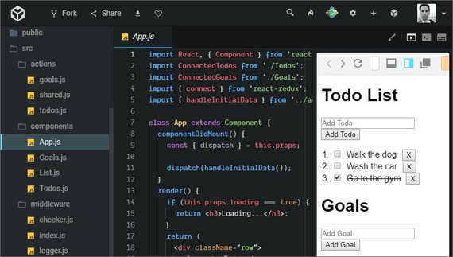](assets/images/day16.jpg)<br>
**Live Demo:** [React Redux Todo Goals App](https://codesandbox.io/s/github/james-priest/reactnd-redux-todos-goals-cra) on CodeSandbox

**Progress:** Continued Udacity Redux lesson for my React Nanodegree Program.

This lesson was showed how to organize and structure a React Redux app using the [Rails-style pattern](https://redux.js.org/faq/code-structure) folder structure.

This splits files according to function with these folders.

- actions
- constants
- reducers
- containers
- components

The exercise involved splitting all existing code for my Todo & Goals app according to this structure.

You can read more in my notes: [Udacity React & Redux - 6.5 Folder Structure](https://james-priest.github.io/udacity-nanodegree-react/course-notes/react-redux.html#66-folder-structure)

**Links:**
- Live Demo - [React Redux Todo Goals App](https://codesandbox.io/s/github/james-priest/reactnd-redux-todos-goals-cra) on CodeSandbox
- Repo - [React Redux Todos & Goals App](https://github.com/james-priest/reactnd-redux-todos-goals-cra) on GitHub
- Course notes - [Udacity React & Redux](https://james-priest.github.io/udacity-nanodegree-react/course-notes/react-redux.html#react--redux)
- Link to [Udacity React Nanodegree Program](https://www.udacity.com/course/react-nanodegree--nd019)

---

## 15. React Redux Bindings
### Day 15: March 15, 2019 - Friday

**Project:** [Udacity React Nanodegree Program](https://www.udacity.com/course/react-nanodegree--nd019)

[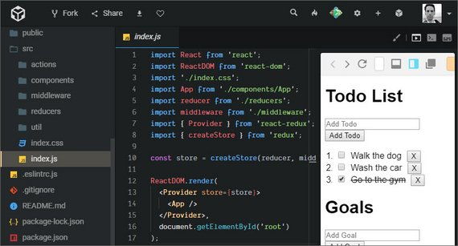](assets/images/day15.jpg)<br>
**Live Demo:** [React Redux Todo Goals App](https://codesandbox.io/s/github/james-priest/reactnd-redux-todos-goals-cra) on CodeSandbox

**Progress:** Continued Udacity Redux lesson for my React Nanodegree Program.

This lesson was about implementing the `react-redux` library to provide an efficient way to pass a Redux store to our React components.

This included

- Importing the `react-redux` library
- Wrapping `App` with Provider and passing in the store
- Using `connect()` to map state & dispatch to props and then passing in the component we want to connect the redux store to.

You can read more in my notes: [Udacity React & Redux - 6.5 react-redux Bindings](https://james-priest.github.io/udacity-nanodegree-react/course-notes/react-redux.html#64-build-custom-connect)

**Links:**
- Live Demo - [React Redux Todo Goals App](https://codesandbox.io/s/github/james-priest/reactnd-redux-todos-goals-cra) on CodeSandbox
- Repo - [React Redux Todos & Goals App](https://github.com/james-priest/reactnd-redux-todos-goals-cra) on GitHub
- Course notes - [Udacity React & Redux](https://james-priest.github.io/udacity-nanodegree-react/course-notes/react-redux.html#react--redux)
- Link to [Udacity React Nanodegree Program](https://www.udacity.com/course/react-nanodegree--nd019)

---

## 14. Connected Components
### Day 14: March 14, 2019 - Thursday

**Project:** [Udacity React Nanodegree Program](https://www.udacity.com/course/react-nanodegree--nd019)

[](https://james-priest.github.io/udacity-nanodegree-react/assets/images/rr47.jpg)<br>
**Live Demo:** [Context API Todo Goals App](https://codesandbox.io/s/l5m5n58rx7?fontsize=14) on CodeSandbox

**Progress:** Continued Udacity Redux lesson for my React Nanodegree Program.

This lesson had us write code to replicate the functionality from `react-redux`.

This included

- Creating a Connected component to wrap a Provider
- Writing a connect method
- Ensuring connect is capable of being passed a function and currying a component for composition

You can read more in my notes: [Udacity React & Redux - 6.3 Add Context to Todos](https://james-priest.github.io/udacity-nanodegree-react/course-notes/react-redux.html#63-add-context-to-todos)

**Links:**
- Live Demo - [Context API Todo Goals App](https://codesandbox.io/s/l5m5n58rx7?fontsize=14) on CodeSandbox
- Repo - [Redux Todos & Goals App](https://github.com/james-priest/reactnd-redux-todos-goals/tree/master) on GitHub
- Course notes - [Udacity React & Redux](https://james-priest.github.io/udacity-nanodegree-react/course-notes/react-redux.html#react--redux)
- Link to [Udacity React Nanodegree Program](https://www.udacity.com/course/react-nanodegree--nd019)

---

## 13. React Context API
### Day 13: March 13, 2019 - Wednesday

**Project:** [Udacity React Nanodegree Program](https://www.udacity.com/course/react-nanodegree--nd019)

[](https://james-priest.github.io/udacity-nanodegree-react/assets/images/rr48.jpg)<br>
**Live Demo:** [Context API Todo Goals App](https://codesandbox.io/s/l5m5n58rx7?fontsize=14) on CodeSandbox

**Progress:** Continued Udacity Redux lesson for my React Nanodegree Program.

This lesson covered the use of React's Context API which gives deeply nested components access to props without having to pass them all the way down the hierarchy.

It uses:

- Declarative syntax
- `<Context.Provider>` to accept data which is to be passed to a consumer component
- `<Context.Consumer>` which accepts a child function that provides access to the data and returns JSX.

```jsx
// Provider
class App extends React.Component {
  render() {
  const name = 'Tyler';

  return (
    <Context.Provider value={name}>
      <Parent />
    </Context.Provider>
    );
  }
}

// Consumer
function Grandchild ({ name }) {
  return (
    <Context.Consumer>
      {(name) => (
        <div>
          <h1>Grandchild</h1>
          <h3>Name: {name}</h3>
        </div>
      )}
    </Context.Consumer>
  );
}
```

You can read more in my notes: [Udacity React & Redux - 6.2 React's Context API](https://james-priest.github.io/udacity-nanodegree-react/course-notes/react-redux.html#62-reacts-context-api)

**Links:**
- Live Demo - [Context API Todo Goals App](https://codesandbox.io/s/l5m5n58rx7?fontsize=14) on CodeSandbox
- Repo - [Redux Todos & Goals App](https://github.com/james-priest/reactnd-redux-todos-goals/tree/master) on GitHub
- Course notes - [Udacity React & Redux](https://james-priest.github.io/udacity-nanodegree-react/course-notes/react-redux.html#react--redux)
- Link to [Udacity React Nanodegree Program](https://www.udacity.com/course/react-nanodegree--nd019)

---

## 12. Redux Thunk
### Day 12: March 11, 2019 - Monday

**Project:** [Udacity React Nanodegree Program](https://www.udacity.com/course/react-nanodegree--nd019)

[](https://james-priest.github.io/udacity-nanodegree-react/assets/images/rr45.jpg)<br>
**Live Demo:** [Async Redux Todo Goals App](https://codesandbox.io/s/0pkwq6o26l?fontsize=14) on CodeSandbox

**Progress:** Continued Udacity Redux lesson for my React Nanodegree Program.

This lesson covered the use of redux-thunk  middleware which allows us to run business logic and/or asynchronous code from our action creators.

This provides the following benefits:

- Cleaner separation between UI logic & data fetching logic.
- Ability to run async code, dispatch other actions, or update the action object prior to submitting the action to the reducer.

Redux middleware sits between the dispatch of an action and the running of the reducer. redux-thunk inspects what is returned from the action creator and passes it to reducer if it is an object. If it's a function then it invokes the function before finally passing the final object to the reducer.

You can read more in my notes: [Udacity React & Redux - 5.4 Thunk](https://james-priest.github.io/udacity-nanodegree-react/course-notes/react-redux.html#54-thunk)

**Links:**
- Live Demo - [Async Redux Todo Goals App](https://codesandbox.io/s/0pkwq6o26l?fontsize=14) on CodeSandbox
- Repo - [Redux Todos & Goals App](https://github.com/james-priest/reactnd-redux-todos-goals/tree/master) on GitHub
- Course notes - [Udacity React & Redux](https://james-priest.github.io/udacity-nanodegree-react/course-notes/react-redux.html#react--redux)
- Link to [Udacity React Nanodegree Program](https://www.udacity.com/course/react-nanodegree--nd019)

---

## 11. Redux Optimistic Updates
### Day 11: March 10, 2019 - Sunday

**Project:** [Udacity React Nanodegree Program](https://www.udacity.com/course/react-nanodegree--nd019)

[](https://james-priest.github.io/udacity-nanodegree-react/assets/images/rr43.jpg)<br>
**Live Demo:** [Async Redux Todo Goals App](https://codesandbox.io/s/0pkwq6o26l?fontsize=14) on CodeSandbox

**Progress:** Continued Udacity Redux lesson for my React Nanodegree Program.

This lesson covered using both optimistic and pessimistic updates to the database.

- An optimistic update modifies the Redux store prior to getting a successful confirmation back from the database.
- Pessimistic updates will only update the Redux store upon the return of a successful async request.

The reason to use optimistic updates is to provide a better UX. This updates the UI immediately when a user initiates an action rather than waiting until a response is returned.

You can read more in my notes: [Udacity React & Redux - 5.3 Optimistic Updates](https://james-priest.github.io/udacity-nanodegree-react/course-notes/react-redux.html#53-optimistic-updates)

**Links:**
- Live Demo - [Async Redux Todo Goals App](https://codesandbox.io/s/0pkwq6o26l?fontsize=14) on CodeSandbox
- Repo - [Redux Todos & Goals App](https://github.com/james-priest/reactnd-redux-todos-goals/tree/master) on GitHub
- Course notes - [Udacity React & Redux](https://james-priest.github.io/udacity-nanodegree-react/course-notes/react-redux.html#react--redux)
- Link to [Udacity React Nanodegree Program](https://www.udacity.com/course/react-nanodegree--nd019)

---

## 10. Asynchronous Redux
### Day 10: March 9, 2019 - Saturday

**Project:** [Udacity React Nanodegree Program](https://www.udacity.com/course/react-nanodegree--nd019)

[](https://james-priest.github.io/udacity-nanodegree-react/assets/images/rr41.jpg)<br>
**Live Demo:** [Async Redux Todo Goals App](https://codesandbox.io/s/0pkwq6o26l?fontsize=14) on CodeSandbox

**Progress:** Continued Udacity Redux lesson for my React Nanodegree Program.

This lesson introduced async operation handling in Redux. This covered:

- Fetching the request in `componentDidMount()`
- Creating a new receiveDataAction method
- Dispatching then method when data is received

You can read more in my notes: [Udacity React & Redux - 5.1 Asynchronous Redux](https://james-priest.github.io/udacity-nanodegree-react/course-notes/react-redux.html#5-asynchronous-redux)

**Links:**
- Live Demo - [Async Redux Todo Goals App](https://codesandbox.io/s/0pkwq6o26l?fontsize=14) on CodeSandbox
- Repo - [Redux Todos & Goals App](https://github.com/james-priest/reactnd-redux-todos-goals/tree/master) on GitHub
- Course notes - [Udacity React & Redux](https://james-priest.github.io/udacity-nanodegree-react/course-notes/react-redux.html#react--redux)
- Link to [Udacity React Nanodegree Program](https://www.udacity.com/course/react-nanodegree--nd019)

---

## 9. React with Redux
### Day 9: March 8, 2019 - Friday

**Project:** [Udacity React Nanodegree Program](https://www.udacity.com/course/react-nanodegree--nd019)

[](https://james-priest.github.io/udacity-nanodegree-react/assets/images/rr40.jpg)<br>
**Live Demo:** [React Redux Todo Goals App](https://codesandbox.io/s/v3k1xp8ql7?fontsize=14) on CodeSandbox

**Progress:** Continued Udacity Redux lesson for my React Nanodegree Program.

This lesson introduced using React with Redux. The goals were:

- Convert DOM-based UI to React UI
- Pass the Redux store as a prop to React components
- Dispatch actions from field methods based on user interaction

You can read more in my notes: [Udacity React & Redux - 4.1 React with Redux](https://james-priest.github.io/udacity-nanodegree-react/course-notes/react-redux.html#4-redux-with-react)

**Links:**
- Live Demo - [React Redux Todo Goals App](https://codesandbox.io/s/v3k1xp8ql7?fontsize=14) on CodeSandbox
- Repo - [Redux Todos & Goals App](https://github.com/james-priest/reactnd-redux-todos-goals/tree/master) on GitHub
- Course notes - [Udacity React & Redux](https://james-priest.github.io/udacity-nanodegree-react/course-notes/react-redux.html#react--redux)
- Link to [Udacity React Nanodegree Program](https://www.udacity.com/course/react-nanodegree--nd019)

---

## 8. Redux Middleware
### Day 8: March 6, 2019 - Wednesday

**Project:** [Udacity React Nanodegree Program](https://www.udacity.com/course/react-nanodegree--nd019)

[](https://james-priest.github.io/udacity-nanodegree-react/assets/images/rr34.jpg)<br>
**Live Demo:** [Redux Todo Goals App](https://codesandbox.io/s/42zkzvrn14?fontsize=14) on CodeSandbox

**Progress:** Continued Udacity Redux lesson for my React Nanodegree Program.

This lesson focused Redux Middleware. Middleware intercepts a dispatched action before it reaches the reducer.

You can do things like:

- Extend Redux with custom functionality
- Validate, filter, or manipulate the data prior to it being reduced into state
- Middleware can be daisy-chained to run multiple extensions on the actions.

You can read more in my notes: [Udacity React & Redux - 3.1 Redux Middleware](https://james-priest.github.io/udacity-nanodegree-react/course-notes/react-redux.html#3-redux-middleware)

**Links:**
- Live Demo - [Redux Todo Goals App](https://codesandbox.io/s/42zkzvrn14?fontsize=14) on CodeSandbox
- Repo - [Redux Todos & Goals App](https://github.com/james-priest/reactnd-redux-todos-goals/tree/master) on GitHub
- Course notes - [Udacity React & Redux](https://james-priest.github.io/udacity-nanodegree-react/course-notes/react-redux.html#react--redux)
- Link to [Udacity React Nanodegree Program](https://www.udacity.com/course/react-nanodegree--nd019)

---

## 7. React Redux Tutorial Pt 4
### Day 7: March 5, 2019 - Tuesday

**Project:** [Udacity React Nanodegree Program](https://www.udacity.com/course/react-nanodegree--nd019)

[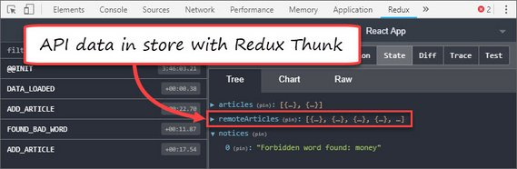](assets/images/day7.jpg)<br>
**Live Demo:** [React Redux Thunk](https://codesandbox.io/s/84o941vx4j?fontsize=14) on CodeSandbox

**Progress:** Continued Udacity Redux lesson for my React Nanodegree Program.

Today I went through the last part of a tutorial called

- *[React Redux Tutorial for Beginners: The Definitive Guide (2019)](https://www.valentinog.com/blog/redux/)*

This focused on introducing redux-thunk middleware which allows asynchronous operations to work with Redux. Some of the specifics around redux-thunk are:

- Normally action creators are limited to returning an object.
- Redux Thunk is middleware that allows action creators to return a function.
- Promise-based asynchronous operations can be conducted in the action creator.
- Actions can be dispatched from the action creator as well.

Here's a sample of async code used  in the action creator.

[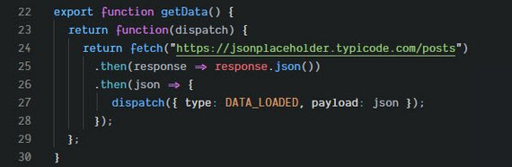](assets/images/day7a.jpg)

**Links:**
- Live Demo - [React Redux Thunk](https://codesandbox.io/s/84o941vx4j?fontsize=14) on CodeSandbox
- GitHub Repo - [react-redux-middleware](https://github.com/james-priest/react-redux-middleware)
- Tutorial - [React Redux Tutorial for Beginners: The Definitive Guide (2019)](https://www.valentinog.com/blog/redux/)
- Course notes - [Udacity React & Redux](https://james-priest.github.io/udacity-nanodegree-react/course-notes/react-redux.html#react--redux)
- Link to [Udacity React Nanodegree Program](https://www.udacity.com/course/react-nanodegree--nd019)

---

## 6. React Redux Tutorial Pt 3
### Day 6: March 4, 2019 - Monday

**Project:** [Udacity React Nanodegree Program](https://www.udacity.com/course/react-nanodegree--nd019)

[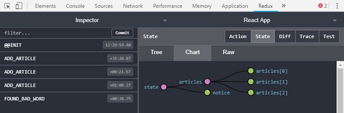](assets/images/day6.jpg)<br>
**Live Demo:** [React Redux Middleware](https://codesandbox.io/s/0oj8rqmo70?fontsize=14) on CodeSandbox

**Progress:** Continued Udacity Redux lesson for my React Nanodegree Program.

Today I went through the third part of a tutorial called

- *[React Redux Tutorial for Beginners: The Definitive Guide (2019)](https://www.valentinog.com/blog/redux/)*

This focused on introducing Redux middleware in order to provide logic to our dispatched actions. It provides the following benefits.

- the logic can live outside React (or any other library/framework)
- middlewares become reusable pieces of logic, easily to reason about
- middlewares can be tested in isolation
- we keep the components clean

In this example I intercept an ADD_ARTICLE action after dispatch and check for the presence of unwanted words.

[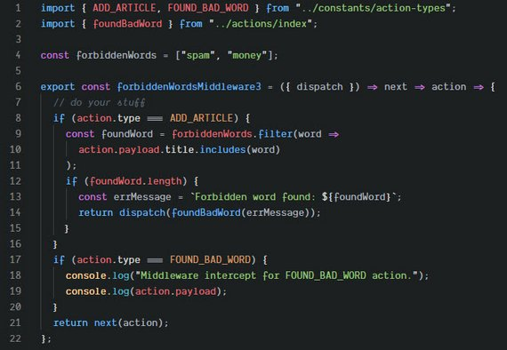](assets/images/day6c.jpg)

If a forbidden word (such as 'money') was found then the FOUND_BAD_WORD action was dispatched instead. It was then handled by our reducer.

Testing out the logic filters out entries with unwanted words.

[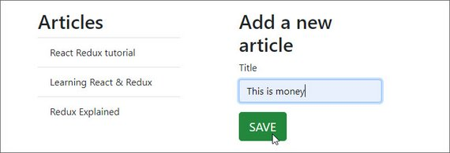](assets/images/day6b.jpg)

Our state is displayed using Redux DevTools.

[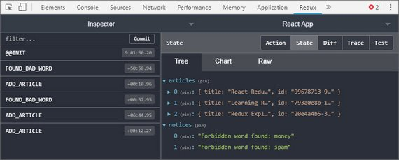](assets/images/day6a.jpg)

**Links:**
- Live Demo - [React Redux Middleware](https://codesandbox.io/s/0oj8rqmo70?fontsize=14) on CodeSandbox
- GitHub Repo - [react-redux-middleware](https://github.com/james-priest/react-redux-middleware)
- Tutorial - [React Redux Tutorial for Beginners: The Definitive Guide (2019)](https://www.valentinog.com/blog/redux/)
- Course notes - [Udacity React & Redux](https://james-priest.github.io/udacity-nanodegree-react/course-notes/react-redux.html#react--redux)
- Link to [Udacity React Nanodegree Program](https://www.udacity.com/course/react-nanodegree--nd019)

---

## 5. React Redux Tutorial Pt 2
### Day 5: March 3, 2019 - Sunday

**Project:** [Udacity React Nanodegree Program](https://www.udacity.com/course/react-nanodegree--nd019)

[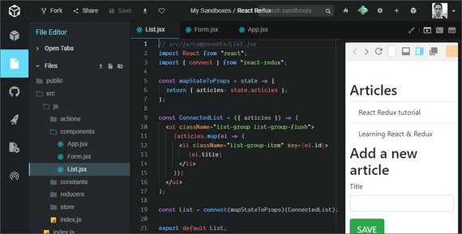](assets/images/day5.jpg)<br>
**Live Demo:** [React Redux](https://codesandbox.io/s/v3ykn3oo5?fontsize=14) on CodeSandbox

**Progress:** Continued Udacity Redux lesson for my React Nanodegree Program.

Today I went through the second part of a tutorial called

- *[React Redux Tutorial for Beginners: The Definitive Guide (2019)](https://www.valentinog.com/blog/redux/)*

[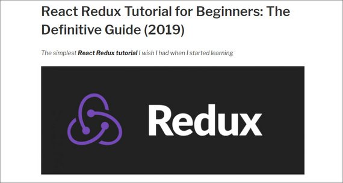](assets/images/day5a.jpg)

This focused on combining Redux & React with the react-redux package and doing the following:

- Wrapping the app with a `<Provider>` HOC (Higher Order Component)
- Calling `connect()` on any components we want to connect to Redux
- Using `mapStateToProps` and `mapDispatchToProps` to allow us to access state and dispatch from a React component's props.  

This was put into practice by creating an App, List, and Form component.

- App -  parent component containing List and Form. App is wrapped with `<Provider>` to allow React to access Redux store.
- List - used `mapStateToProps` to display titles from Redux store (state).
- Form - used `mapDispatchToProps` to dispatch ADD_ARTICLE action and update the store.

**Links:**
- Live Demo - [Redux Redux](https://codesandbox.io/s/v3ykn3oo5?fontsize=14) on CodeSandbox
- Tutorial - [React Redux Tutorial for Beginners: The Definitive Guide (2019)](https://www.valentinog.com/blog/redux/)
- Course notes - [Udacity React & Redux](https://james-priest.github.io/udacity-nanodegree-react/course-notes/react-redux.html#react--redux)
- Link to [Udacity React Nanodegree Program](https://www.udacity.com/course/react-nanodegree--nd019)

---

## 4. React Redux Tutorial Pt 1
### Day 4: March 2, 2019 - Saturday

**Project:** [Udacity React Nanodegree Program](https://www.udacity.com/course/react-nanodegree--nd019)

[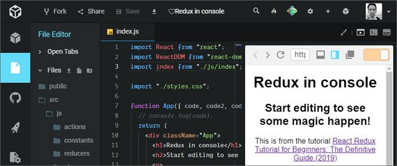](assets/images/day4.jpg)<br>
**Live Demo:** [Redux in console](https://codesandbox.io/s/9z2py96vqo?fontsize=14) on CodeSandbox

**Progress:** Continued Udacity Redux lesson for my React Nanodegree Program.

Today I went through the first part of a tutorial called

- *[React Redux Tutorial for Beginners: The Definitive Guide (2019)](https://www.valentinog.com/blog/redux/)*

This first half focused on the basic elements of Redux and using it in console.

- The store
- Getting state
- Subscribing to state changes
- Dispatching actions

[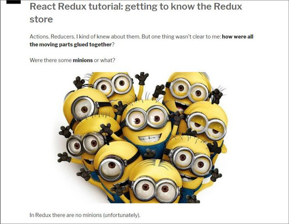](assets/images/day4a.jpg)

The next part will deal with connecting Redux and React together.

**Links:**
- Live Demo - [Redux in console](https://codesandbox.io/s/9z2py96vqo?fontsize=14) on CodeSandbox
- Tutorial - [React Redux Tutorial for Beginners: The Definitive Guide (2019)](https://www.valentinog.com/blog/redux/)
- Course notes - [Udacity React & Redux](https://james-priest.github.io/udacity-nanodegree-react/course-notes/react-redux.html#react--redux)
- Link to [Udacity React Nanodegree Program](https://www.udacity.com/course/react-nanodegree--nd019)

---

## 3. Create Log Template Repo
### Day 3: March 1, 2019 - Friday

**Project:** 100 Days of Code Log  Template

[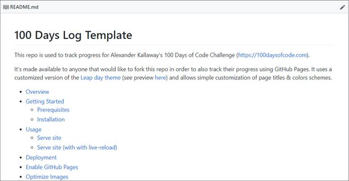](assets/images/day3.jpg)

**Progress:** Created a new GitHub repo for my 100 Days of Code Log Template project.

I quickly realized that I needed to create a separate master template repo from the one I had my current log in.

Separating the template from the log allows me to update my log without in affecting the template and update the template with affecting the log. This way anyone following changes on the template won't be notified on every log commit I make.

Additionally, any changes to the template or template instructions can the be pulled down without overwriting my log entires.

**Links:**
- GitHub repo - [https://github.com/james-priest/100-days-log-template](https://github.com/james-priest/100-days-log-template)
- Demo Site - [Sample Template Site](https://james-priest.github.io/100-days-log-template/log1.html)

---

## 2. Redux, JS, & HTML UI
### Day 2: February 28, 2019 - Thursday

**Project:** [Udacity React Nanodegree Program](https://www.udacity.com/course/react-nanodegree--nd019)

[](https://james-priest.github.io/udacity-nanodegree-react/assets/images/rr32.jpg)<br>
**Live Demo:** [Redux Todo Goals App](https://codesandbox.io/s/42zkzvrn14?fontsize=14) on CodeSandbox

**Progress:** Continued Udacity Redux lesson for my React Nanodegree Program.

This lesson focused implementing Redux with vanilla JavaScript and a simple HTML UI.

The kept the focus limited to:

- The store
- Getting state
- Subscribing to state changes
- Dispatching actions

You can read more in my notes: [Udacity React & Redux - 2.4 Introducing Redux](https://james-priest.github.io/udacity-nanodegree-react/course-notes/react-redux.html#24-introducing-redux)

**Links:**
- Live Demo - [Redux Todo Goals App](https://codesandbox.io/s/42zkzvrn14?fontsize=14) on CodeSandbox
- Repo - [Redux Todos & Goals App](https://github.com/james-priest/reactnd-redux-todos-goals/tree/master) on GitHub
- Course notes - [Udacity React & Redux](https://james-priest.github.io/udacity-nanodegree-react/course-notes/react-redux.html#react--redux)
- Link to [Udacity React Nanodegree Program](https://www.udacity.com/course/react-nanodegree--nd019)

---

## 1. Round 5 Code Log & Repo
### Day 1: February 26, 2019 - Tuesday

**Project:** [Udacity React Nanodegree Program](https://www.udacity.com/course/react-nanodegree--nd019)

[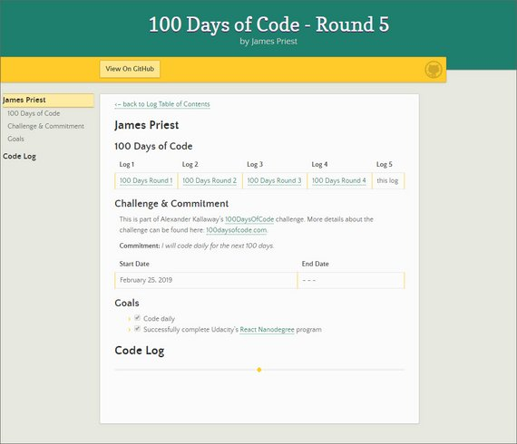](assets/images/day1.jpg)

**Progress:** Created a new GitHub repo for my Round 5 code log.

This repo is redesigned so that it can be forked and cloned for others to use. I'm still in the process of writing out the README to cover the following areas

- installation instructions
- usage instructions
- customization
- image optimization
- set-up & testing

**Links:** My GitHub repo [https://github.com/james-priest/100-days-log](https://github.com/james-priest/100-days-log)